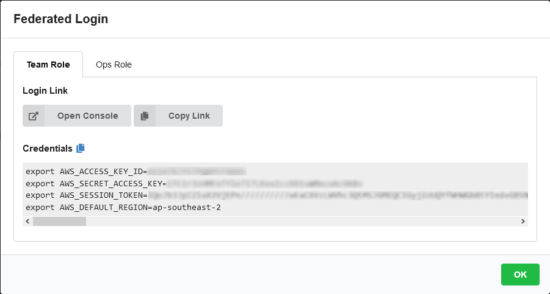

+++
title = "AWS Workshop Portal"
date =  2020-08-07T08:08:53+10:00
draft = false

tags = []
categories = []

# Set the page as a chapter, changing the way it's displayed
chapter = false

# provides a flexible way to handle order for your pages.
weight = 5
# Table of content (toc) is enabled by default. Set this parameter to true to disable it.
# Note: Toc is always disabled for chapter pages
disableToc = "false"
# If set, this will be used for the page's menu entry (instead of the `title` attribute)
menuTitle = ""
# The title of the page in menu will be prefixed by this HTML content
pre = "<b></b>"
# The title of the page in menu will be postfixed by this HTML content
post = ""
# Hide a menu entry by setting this to true
hidden = false
# Display name of this page modifier. If set, it will be displayed in the footer.
LastModifierDisplayName = ""
# Email of this page modifier. If set with LastModifierDisplayName, it will be displayed in the footer
LastModifierEmail = ""
+++

Login to AWS Workshop Portal
This workshop creates an AWS account. You will need the **Participant Hash** provided upon entry, and your email address to track your unique session.

{}
Use Chrome or Firefox to ensure a good experience.
{}

Connect to the portal by clicking the button or browsing to https://dashboard.eventengine.run. The following screen will be displayed.

Enter the provided hash in the text box. The button on the bottom right corner changes to Accept Terms & Login. Click on that button to continue.

Click on AWS Console on dashboard.

Take the defaults and click on Open AWS Console. This will open AWS Console in a new browser tab.
