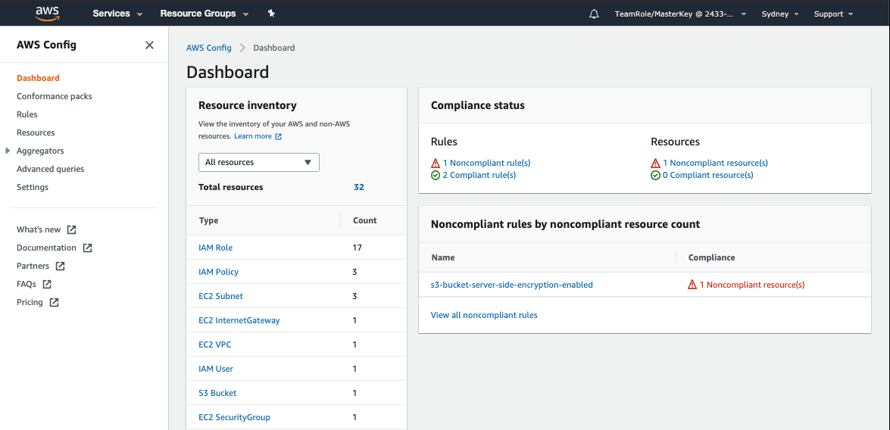
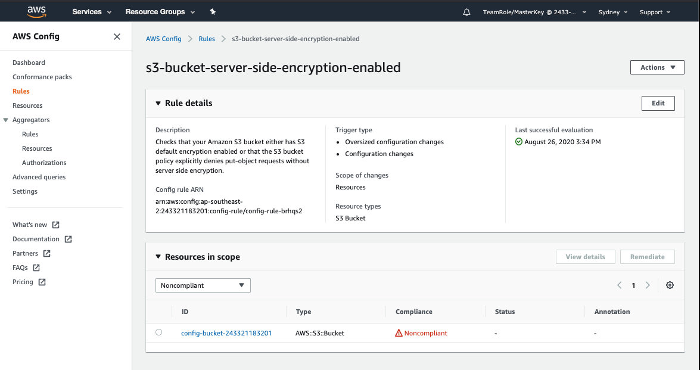
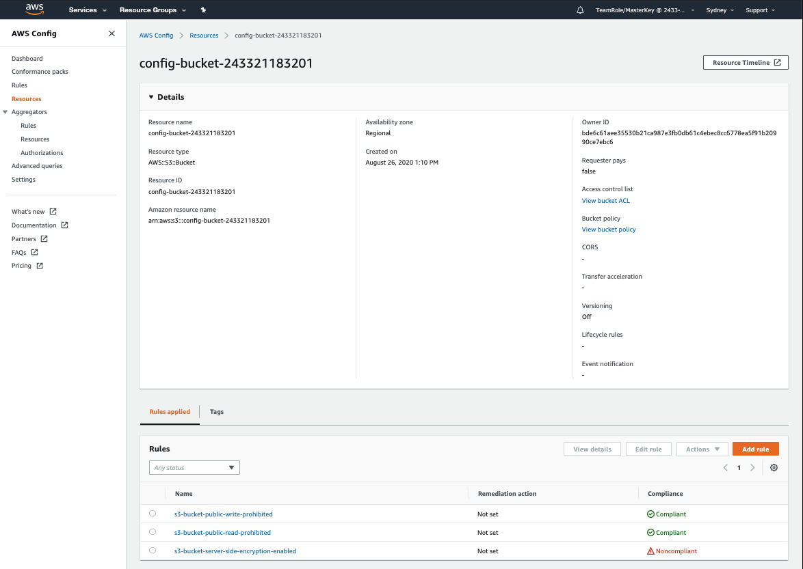

+++
title = "Review Dashboard"
date = 2020-08-07T09:39:18+10:00
draft = false

# Set the page as a chapter, changing the way it's displayed
chapter = false

# provides a flexible way to handle order for your pages.
weight = 300
# Table of content (toc) is enabled by default. Set this parameter to true to disable it.
# Note: Toc is always disabled for chapter pages
disableToc = "false"
# If set, this will be used for the page's menu entry (instead of the `title` attribute)
menuTitle = ""
# The title of the page in menu will be prefixed by this HTML content
pre = "<b>3. </b>"
# The title of the page in menu will be postfixed by this HTML content
post = ""
# Hide a menu entry by setting this to true
hidden = false
# Display name of this page modifier. If set, it will be displayed in the footer.
LastModifierDisplayName = ""
# Email of this page modifier. If set with LastModifierDisplayName, it will be displayed in the footer
LastModifierEmail = ""
+++

#### 1. Explore the Dashboard ####
Take a few minutes to explore the information on the Dashboard.  

On the right, in the **Compliance status** window you can see that there are a total of 3 rules - 1 Noncompliant and 2 Compliant, you can also see that there is 1 resource which is noncompliant.

The **Noncompliant rules by noncompliant resource count** lists noncompliant rules listed by the number of non-compliant resources.  In this case there is only one noncompliant rule and a single resource.

To the left is the Resource Inventory, this lists the resources in the account.  In this case the total shown is 32 resources.  Note that there is only 1 S3 Bucket and our three rules all relate to S3 Buckets so only a singe resource is counted in our compliance status.

#### 2. Review noncompliant rule(s) ####
In the **Noncompliant rules by noncompliant resource count** window select S3-bucket-server-side-encryption-enabled. This will take you to a screen displaying the rule details and the **Resources in scope**.

#### 3. Drill into noncompliant resource ####
Click on the bucket name under **Resources in scope** to display the details of the noncompliant bucket.

