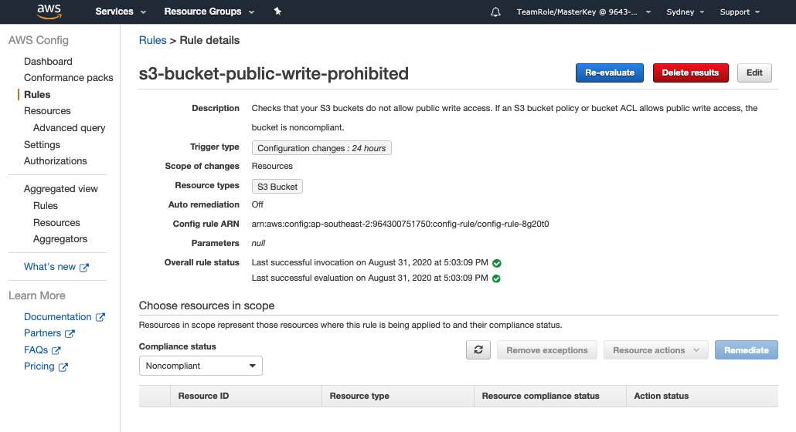

+++
title = "Rule Scope"
date = 2020-08-07T09:39:18+10:00
draft = true

# Set the page as a chapter, changing the way it's displayed
chapter = false

# provides a flexible way to handle order for your pages.
weight = 400
# Table of content (toc) is enabled by default. Set this parameter to true to disable it.
# Note: Toc is always disabled for chapter pages
disableToc = "false"
# If set, this will be used for the page's menu entry (instead of the `title` attribute)
menuTitle = ""
# The title of the page in menu will be prefixed by this HTML content
pre = "<b>4. </b>"
# The title of the page in menu will be postfixed by this HTML content
post = ""
# Hide a menu entry by setting this to true
hidden = false
# Display name of this page modifier. If set, it will be displayed in the footer.
LastModifierDisplayName = ""
# Email of this page modifier. If set with LastModifierDisplayName, it will be displayed in the footer
LastModifierEmail = ""
+++

Controls should be considered from both a design and operating effectiveness perspective. As you think about your assurance program you will want to consider the frequency and breath of your assurance. With AWS Config rules you can control the frequency and scope of application of the rule.

#### Frequency of Operation ####
AWS Config compares your resources to the conditions of the rule. After this initial evaluation, AWS Config continues to run evaluations each time one is triggered. The evaluation triggers are defined as part of the rule, and they can include one or both of the following types:  
- **Configuration changes** – AWS Config triggers the evaluation when any resource that matches the
rule's scope changes in configuration. The evaluation runs after AWS Config sends a configuration item
change notification.
- **Periodic** – AWS Config runs evaluations for the rule at a frequency that you choose (for example, every 24 hours).

#### Scope of Application
The rules can be applied based on;
- **Type of resources** - When any resource that matches the specified type, or the type plus identifier, is created, changed, or deleted - in this case we applied the rules to all S3 buckets in the account.
- **Tags** - When any resource with the specified tag is created, changed, or deleted. A tag is a simple label consisting of a customer-defined key and an optional value that can make it easier to manage, search for, and filter resources. Tags are an important part of effective operations and governance and can be used in many ways including for the classification of data. The [Tagging Best Practice Whitepaper](https://d1.awsstatic.com/whitepapers/aws-tagging-best-practices.pdf) is a great resource to find out more.
- **All changes** - When any resource recorded by AWS Config is created, changed, or deleted.

To review these settings go to the Rules page by selecting Rules on the menu bar to the left and click on the s3-bucket-public-write-prohibited rule name.  This will take you to the rules page.

{}
Note the Trigger type will show if the rule is triggered by configuration changes and the frequency if it is periodic. The resource types shows the scope of application as discussed above - in this case the rule applies to all S3 Buckets in the account.
{}

