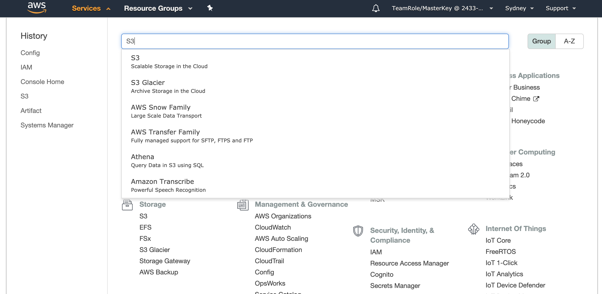
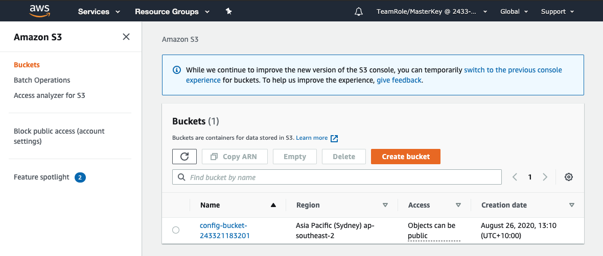
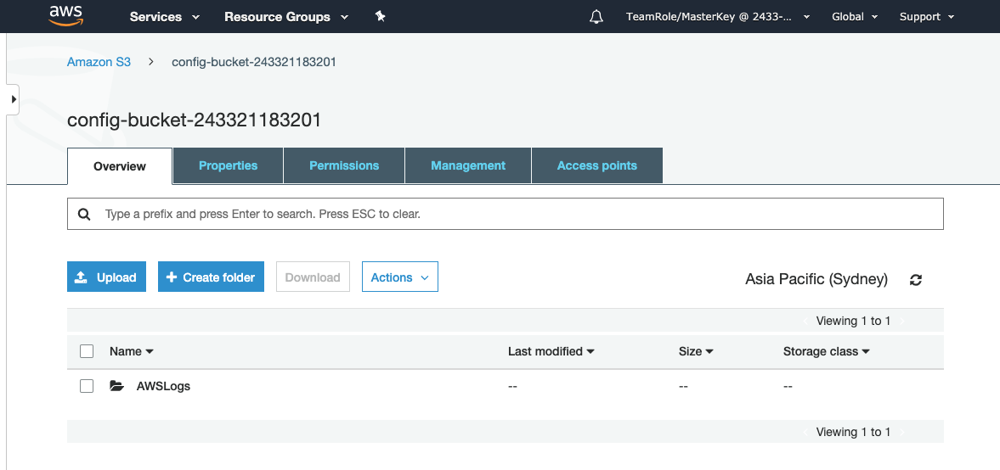
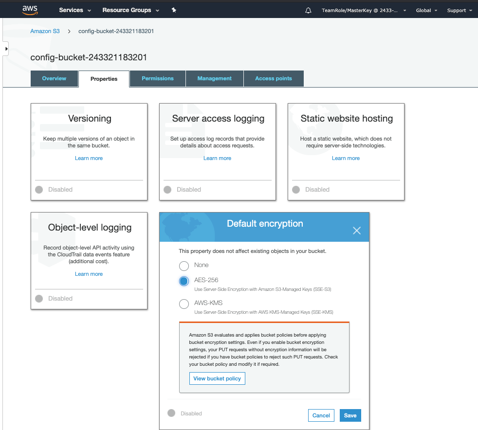
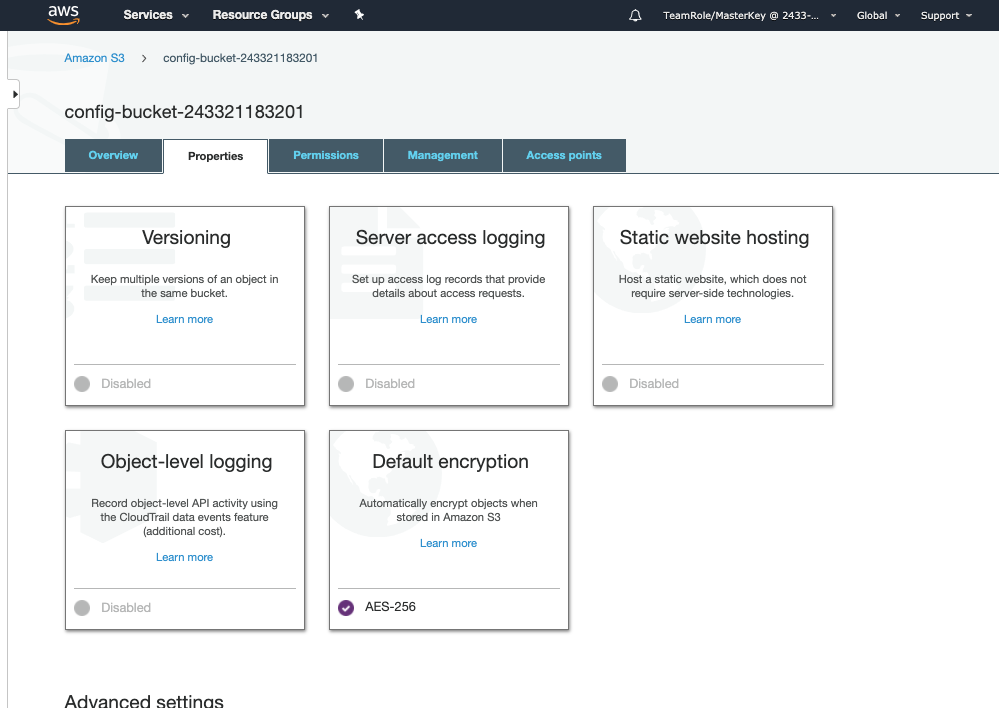

+++
title = "Remediate"
date = 2020-08-07T09:39:18+10:00
draft = false

# Set the page as a chapter, changing the way it's displayed
chapter = false

# provides a flexible way to handle order for your pages.
weight = 500
# Table of content (toc) is enabled by default. Set this parameter to true to disable it.
# Note: Toc is always disabled for chapter pages
disableToc = "false"
# If set, this will be used for the page's menu entry (instead of the `title` attribute)
menuTitle = ""
# The title of the page in menu will be prefixed by this HTML content
pre = "<b>5. </b>"
# The title of the page in menu will be postfixed by this HTML content
post = ""
# Hide a menu entry by setting this to true
hidden = false
# Display name of this page modifier. If set, it will be displayed in the footer.
LastModifierDisplayName = ""
# Email of this page modifier. If set with LastModifierDisplayName, it will be displayed in the footer
LastModifierEmail = ""
+++

In this step we will remediate the noncompliant Managed Config Rule S3-bucket-server-side-encryption-enabled. For the purposes of this lab we will remediate the S3 Bucket manually from the AWS Console but in a real production environment you would want to have a remediation script and possibly take advantage of one of the options to automate it's application.

#### 1. The S3 Console ####
First navigate to the S3 Console. To do select Services on the menu bar at the top of the page and select S3. You can can find S3 by either using the search or selecting it from under **Storage**.

You will be taken to the S3 Console.

On the S3 Console you will see the S3 Bucket listed, click on the bucket name.
#### 2. Update the Bucket configuration ####
You are now on the page for the S3 Bucket from here you can see tabs to configure various elements of the bucket.  

The **Overview** tabs shows the folders and files contained in the bucket.

Select the **Properties** tab.

One of the properties you can control from this screen is the default encryption used for the bucket. There are three options; none, AES-256 and AWS-KMS. 

Select AES-256 encryption and click .  You will be returned to the **Properties** tab where you can see the Default encryption is now set to AES-256.

{}
You have now successfully remediated the S3-bucket-server-side-encryption-enabled rule for this bucket. The rule will be re-run against the S3 bucket automatically as the rule is triggered by configuration changes but this may take a few minutes.
{}