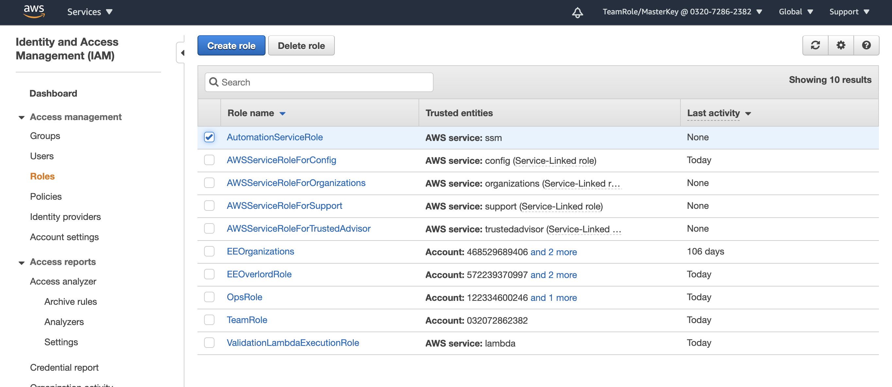
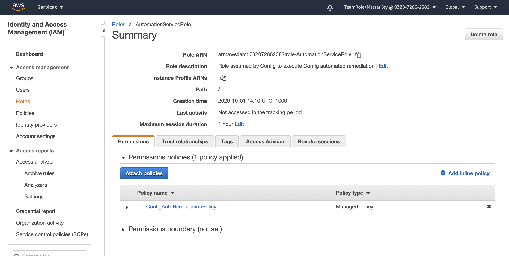
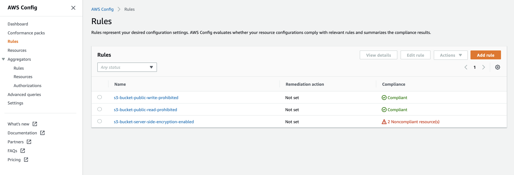
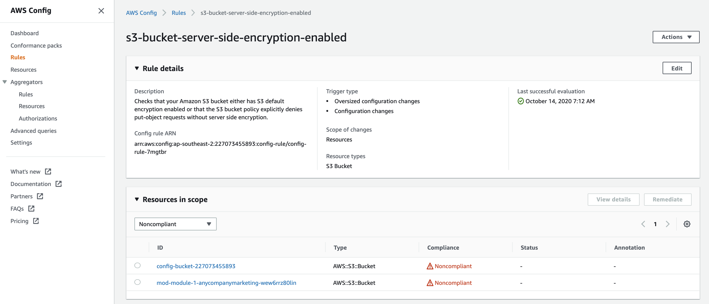
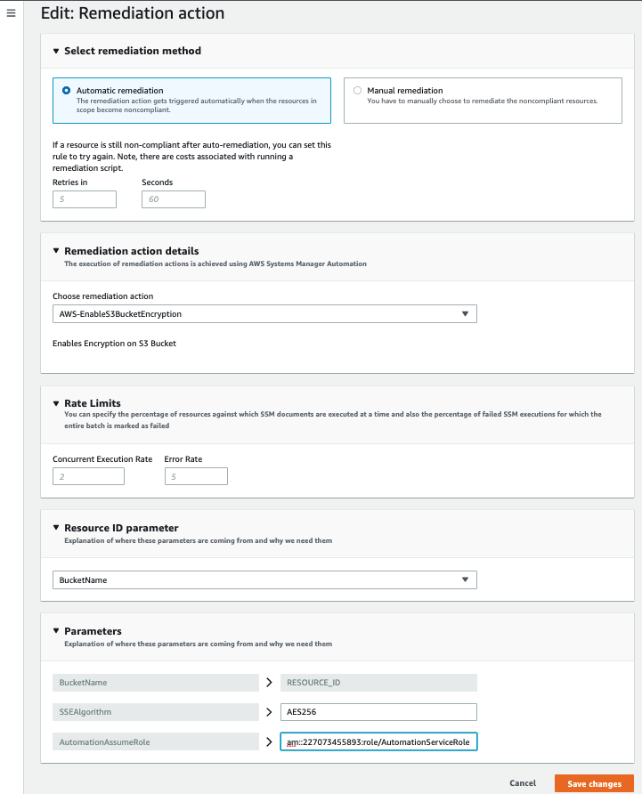

+++
title = "Remediate"
date = 2020-08-07T09:39:18+10:00
draft = false

# Set the page as a chapter, changing the way it's displayed
chapter = false

# provides a flexible way to handle order for your pages.
weight = 500
# Table of content (toc) is enabled by default. Set this parameter to true to disable it.
# Note: Toc is always disabled for chapter pages
disableToc = "false"
# If set, this will be used for the page's menu entry (instead of the `title` attribute)
menuTitle = ""
# The title of the page in menu will be prefixed by this HTML content
pre = "<b>5. </b>"
# The title of the page in menu will be postfixed by this HTML content
post = ""
# Hide a menu entry by setting this to true
hidden = false
# Display name of this page modifier. If set, it will be displayed in the footer.
LastModifierDisplayName = ""
# Email of this page modifier. If set with LastModifierDisplayName, it will be displayed in the footer
LastModifierEmail = ""
+++

Now you can take this from purely detective to a corrective controls by adding automated remediation to the 
s3-bucket-server-side-encryption-enabled config rule you set-up.

This means that AWS Config will be setup to automatically apply server side encryption to any bucket in the account found that doesn't have it turned.  This moves this particular detective controls, to an automated corrective controls. 

In a production environment you want to carefully choose the actions you automate and the resources that these actions apply to but automation is a powerful way to move to a more proactive risk and controls management stance.

#### 1. Find the AutomationAssumeRole
To turn on the auto remediation action you will need to provide some parameters, one of these is the;
- **AutoAssumeRole** This is the role (and associated permissions) that allows the auto remediation to happen. We will ue the AutoAssumeRole ARN or [Amazon Resource Name](https://docs.aws.amazon.com/general/latest/gr/aws-arns-and-namespaces.html). The ARN is used to uniquely identify the role.

To find the AutomationAssumeRole you need to go to the **Roles** screen in IAM. From this screen you will see a list of existing roles and up the top you should see AutomationServiceRole. 

Click on the name of the role to see a summary of the role.
At the top of this screen you will see **Role ARN**. Copy the ARN (you can do so easily by clicking the copy 
icon to the right). This is the string you will need to paste into the AutomatedAssumeRole back in Config.

#### 2. Select the s3-bucket-server-side-encryption-enabled rule
Now that you have the ARN it's time to head back to AWS Config.  From the AWS Config Console select **Rules** on the navigation menu on the left. 

From here you will see the three rules you implemented, and that the **Remediation action** for each is "Not set". Click on s3-bucket-server-side-encryption-enabled.

#### 3. Configure Auto remediation
From the rules page, click on the Actions button at the top right.

Complete the form as per below.

The **Resource ID Parameter** must be set to BucketName. This tells Config that the Bucket Name will be variable.

The three main parameters are;
- **AutoAssumeRole** This is the role (and associated permissions) that you copies in step 1. This allows the auto remediation to happen, an [Amazon Resource Name](https://docs.aws.amazon.com/general/latest/gr/aws-arns-and-namespaces.html) (ARN) is used to uniquely identify the role.
- **BucketName** The name of the bucket to apply the auto remediation to. You will should see this is greyed out because you selected BucketName as the **Resource ID Parameter**.  You do not want to specify a particular bucket because we want the remediation to be applied to all buckets.
- **SSEAlgorthum** The encryption algorithm, this must be set to AES256.

Click 

You will then be taken back to the Rules page where you will see the **Remediation action** has been set but the Rule is still showing noncompliant resource(s).  It will take around 5-10 minutes for the remediation actions to run and for the config status to be refreshed. Take a bit of a break and then refresh the screen or move on to another challenge and come back and check.

{}
You have now successfully remediated the S3-bucket-server-side-encryption-enabled rule for this bucket. The rule will be re-run against the S3 bucket automatically as the rule is triggered by configuration changes but this may take a few minutes.
{}