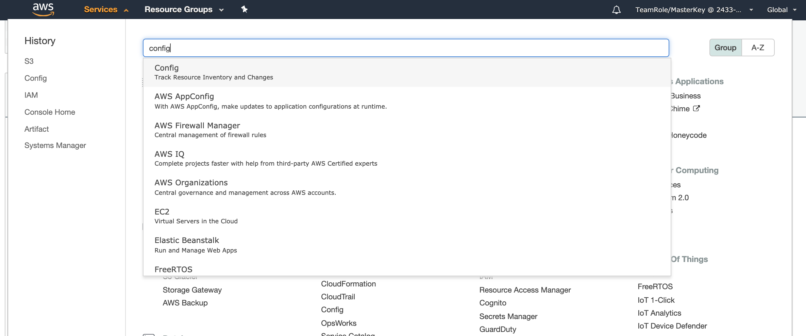
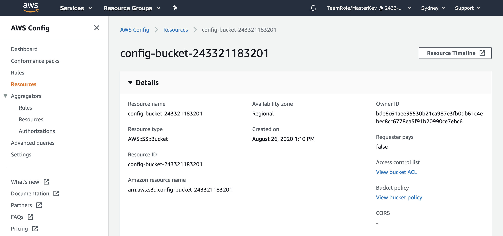
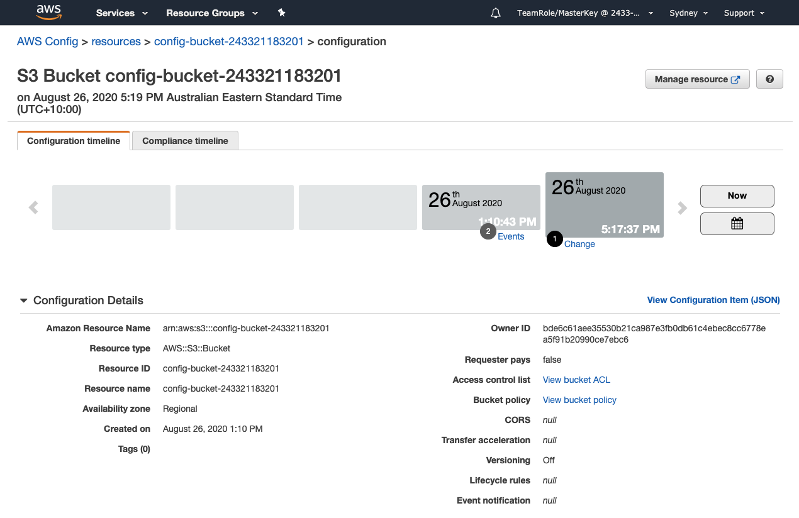
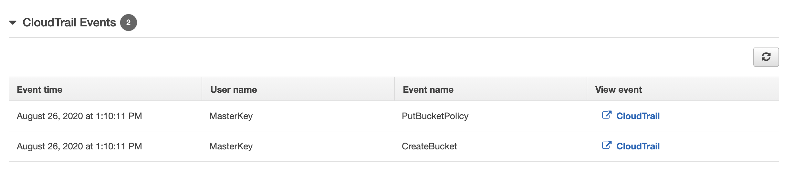
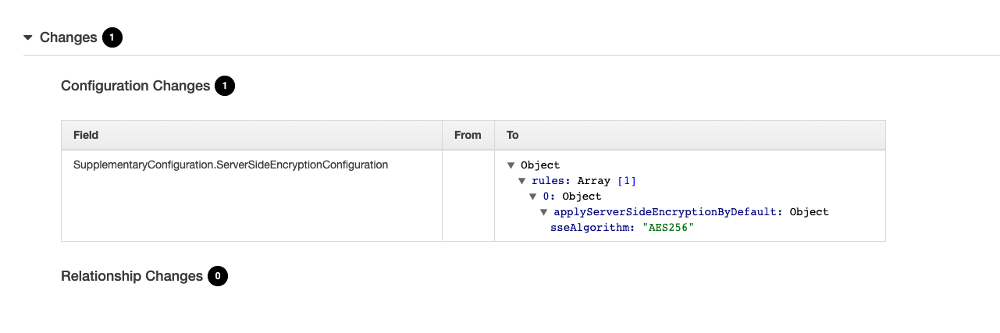
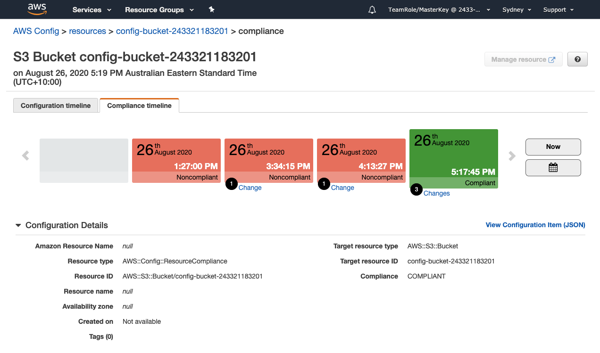

+++
title = "Explore Timelines"
date = 2020-08-07T09:39:18+10:00
draft = false

# Set the page as a chapter, changing the way it's displayed
chapter = false

# provides a flexible way to handle order for your pages.
weight = 600
# Table of content (toc) is enabled by default. Set this parameter to true to disable it.
# Note: Toc is always disabled for chapter pages
disableToc = "false"
# If set, this will be used for the page's menu entry (instead of the `title` attribute)
menuTitle = ""
# The title of the page in menu will be prefixed by this HTML content
pre = "<b>6. </b>"
# The title of the page in menu will be postfixed by this HTML content
post = ""
# Hide a menu entry by setting this to true
hidden = false
# Display name of this page modifier. If set, it will be displayed in the footer.
LastModifierDisplayName = ""
# Email of this page modifier. If set with LastModifierDisplayName, it will be displayed in the footer
LastModifierEmail = ""
+++

#### 1. Return to Config ####
Select Services on the menu bar at the top of the page and select Config. You can can find Config by either using the search or selecting it from under Management & Governance.

#### 2. Access Resource timelines ####
From the Resource screen click the  in the top right.

#### 3. Review Resource configuration timeline ####
You should now see the Configuration timeline tab of the timeline page for the resource. 

On this tab we can see two entries on the timeline.  The first @ 1:10:43 PM is the Resource discovery time and has two Events. Click on the Events hyperlink for this first entry on the timeline or scroll down the page.

This shows that the S3 bucket was created as was a PutBucketPolicy at 1:10:11 PM and provides a link to [AWS CloudTrail](https://aws.amazon.com/cloudtrail/). CloudTrail provides event history of your AWS account activity, including actions taken through the AWS Management Console, AWS SDKs, command line tools, and other AWS services. 

Return now to the timeline a select the second entry on the timeline @ 5:17:37 PM and scroll down the page. You can see that this entry on the timeline logs the application of encryption we did during the remediation step.

#### 4. Review Resource configuration timeline ####
Select the **Compliance timeline** tab and take a few minutes to explore the compliance timeline.  This timeline logs the same events and changes but provides a compliance view of the resource.
