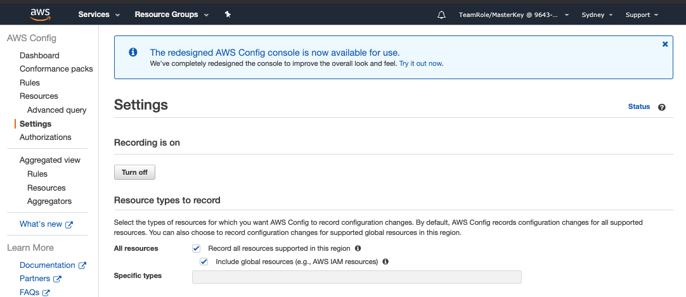
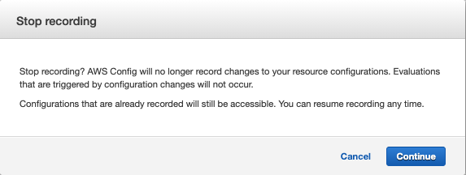
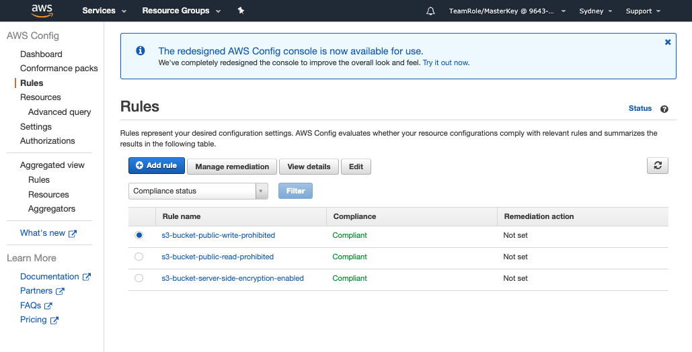
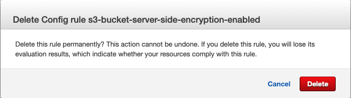
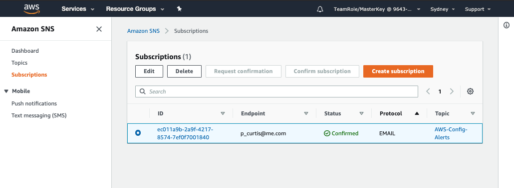
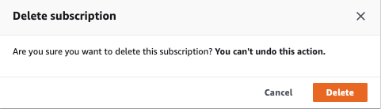
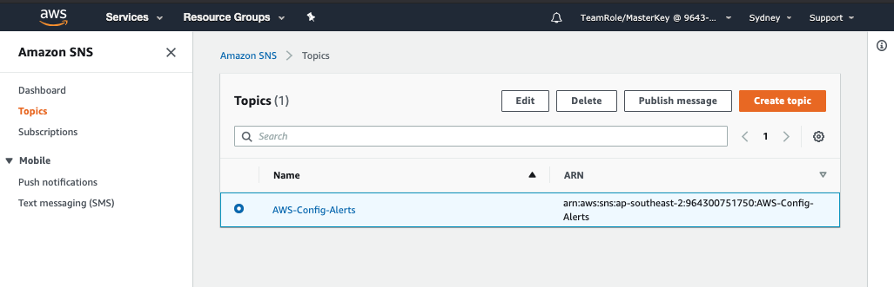
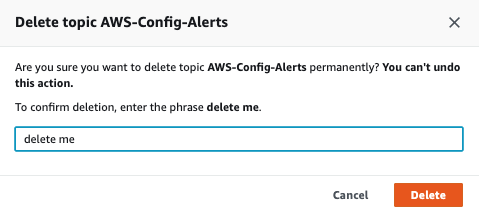

+++
title = "Clean up"
date = 2020-08-07T09:39:18+10:00
draft = true

# Set the page as a chapter, changing the way it's displayed
chapter = false

# provides a flexible way to handle order for your pages.
weight = 700
# Table of content (toc) is enabled by default. Set this parameter to true to disable it.
# Note: Toc is always disabled for chapter pages
disableToc = "false"
# If set, this will be used for the page's menu entry (instead of the `title` attribute)
menuTitle = ""
# The title of the page in menu will be prefixed by this HTML content
pre = "<b>7. </b>"
# The title of the page in menu will be postfixed by this HTML content
post = ""
# Hide a menu entry by setting this to true
hidden = false
# Display name of this page modifier. If set, it will be displayed in the footer.
LastModifierDisplayName = ""
# Email of this page modifier. If set with LastModifierDisplayName, it will be displayed in the footer
LastModifierEmail = ""
+++

#### 1. Turn off Config ####

Go to the settings page and under **Recording is on** click the  button.

A pop-up will ask you to confirm turning off recording. 

Confirm by clicking .

#### 2. Delete Config Rules ####
Return to the Rules page.

For each of the three rules; 
- Select the radio button beside the Rule name
- Click  
- Scroll to the bottom of the page and click 

- On the confirmation pop-up
  Click  to confirm deletion of the rule.

#### 3. Delete the SNS Subscription and Topic ####
Head back over to the SNS Console and select Subscriptions from the Menu.

Select the radio button next to the Subscription and click .

On the confirmation pop-up click .  

Now select Topics from the menu bar.

Select the radio button next to the topic and click .

To confirm deletion click .

{}
Congratulations, you have now completed the lab and cleaned up the account.
{}