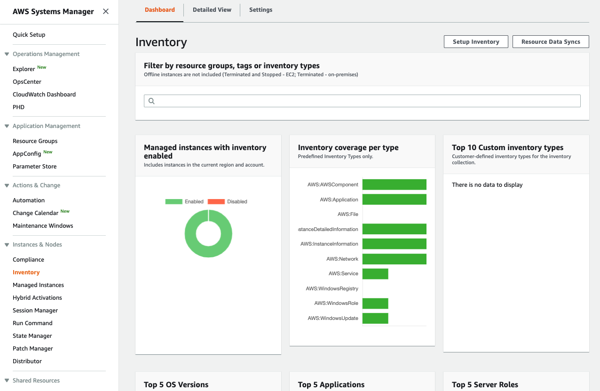
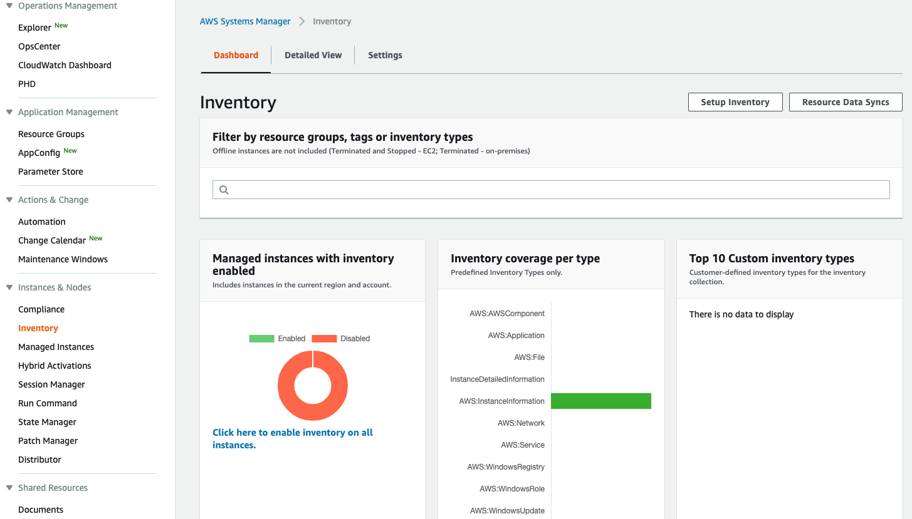

+++
title = "Determine the current OS versions"
date = 2020-08-23T15:17:40+10:00
draft = false

tags = ["AWS Systems Manager", "Detective Controls"]
categories = ["Beginner"]

# Set the page as a chapter, changing the way it's displayed
chapter = false

# provides a flexible way to handle order for your pages.
weight = 1
# Table of content (toc) is enabled by default. Set this parameter to true to disable it.
# Note: Toc is always disabled for chapter pages
disableToc = "false"
# If set, this will be used for the page's menu entry (instead of the `title` attribute)
menuTitle = ""
# The title of the page in menu will be prefixed by this HTML content
pre = ""
# The title of the page in menu will be postfixed by this HTML content
post = ""
# Hide a menu entry by setting this to true
hidden = false
# Display name of this page modifier. If set, it will be displayed in the footer.
LastModifierDisplayName = ""
# Email of this page modifier. If set with LastModifierDisplayName, it will be displayed in the footer
LastModifierEmail = ""
+++

In this step we will use AWS Systems Manager - **Inventory** to determine the operating systems 
versions how many instances are running each operating systems.

#### 1. Go to AWS Systems Manager - Inventory
Select Systems Manager from the AWS Console.

In the navigation pane, choose **Inventory**.

If you can only see the AWS Systems Manager home page, you may need to click on the menu icon (&#9776;) in the top left to open the navigation pane, and then choose **Inventory**.

You will see something similar to the below.

#### 2. Ensure Inventory is enabled
You may see that not all of the instances in the environment have inventory enabled. 

If this is the case enable the inventory and wait for this process to complete.  You may need to wait for a few minutes while the inventory is completed. Reload the page after a few minutes to check progress.

If you scroll down the inventory page you will see summaries of the operating system versions and other software running on the instances.