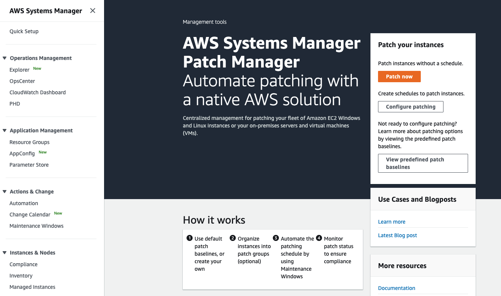
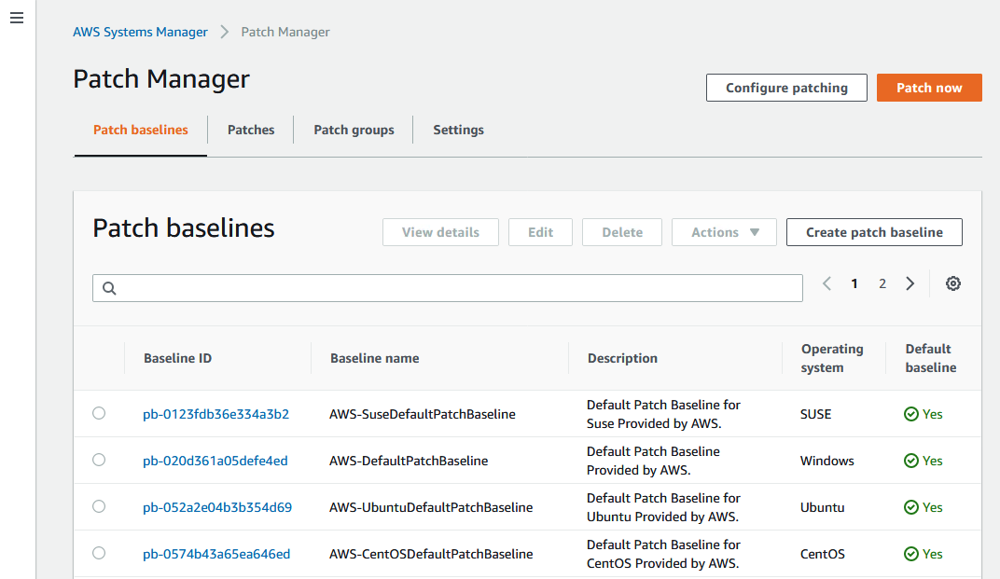
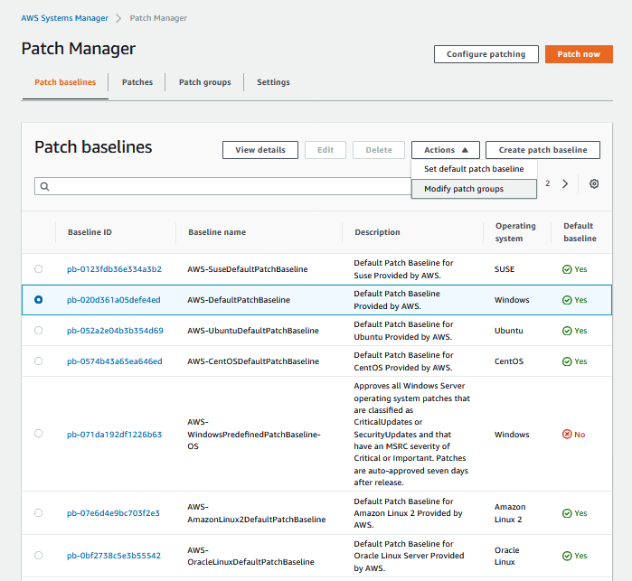
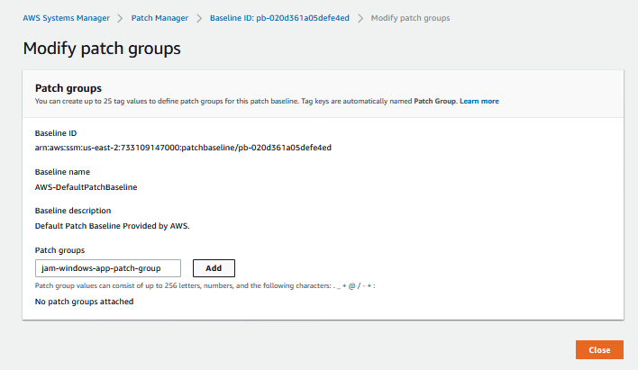

+++
title = "Set patch baselines"
date = 2020-08-23T15:17:40+10:00
draft = false

tags = ["AWS Systems Manager", "Detective Controls"]
categories = ["Beginner"]

# Set the page as a chapter, changing the way it's displayed
chapter = false

# provides a flexible way to handle order for your pages.
weight = 2
# Table of content (toc) is enabled by default. Set this parameter to true to disable it.
# Note: Toc is always disabled for chapter pages
disableToc = "false"
# If set, this will be used for the page's menu entry (instead of the `title` attribute)
menuTitle = ""
# The title of the page in menu will be prefixed by this HTML content
pre = ""
# The title of the page in menu will be postfixed by this HTML content
post = ""
# Hide a menu entry by setting this to true
hidden = false
# Display name of this page modifier. If set, it will be displayed in the footer.
LastModifierDisplayName = ""
# Email of this page modifier. If set with LastModifierDisplayName, it will be displayed in the footer
LastModifierEmail = ""
+++

As well as providing insight into the environment systems manager allows 
you to actively manage instances including applying patches. Patch Manager 
has predefined patch baselines for each operating system it supports. 
You can use these patch baselines to patch your instances, or you can 
create your own. In this Jam we will use the predefined patch baselines.

The environment provided for this challenge includes two fleets of EC2
Instances, one fleet includes three Amazon Linux 2 instances, the other two 
instances running a version of Windows. An EC2 Fleet is a way of grouping and managing EC2 instances and provisioning using the lowest price combination of instances available. You can learn more about Fleets on the [Introducing Amazon EC2 Fleet](https://aws.amazon.com/about-aws/whats-new/2018/04/introducing-amazon-ec2-fleet/) page.

The EC2 instances in the two fleets provided have been grouped so they can receive their their respective patched.  These groups are unsurprisingly called 'Patching Groups'.  The two patch groups that have been created for you are: ```jam-linux-app-patch-group``` and ```jam-windows-app-patch-group```.

Remember the following terms;
- **Patch baseline** - the patches that are to be applied to an operating system to keep it up to date.
- **Patch group** - the set of instances that patched will be applied to.

Your task is to tell Patch Manager which patch baseline to use for your two patching groups. 

The patch baselines we will use are the default baselines for the **Amazon Linux 2** and **Windows** operating systems. We will **Modify patch groups** (the bold is a Hint) to be associated with the patch groups  ```jam-linux-app-patch-group``` and ```jam-windows-app-patch-group```.

To set a patch baseline open the AWS Systems Manager console and in the navigation pane, choose Patch Manager. 

If the AWS Patch Manager home page opens first, click **View predefined patch baselines**, this lists AWS managed patching baselines.



Otherwise you will be taken directly to the **Patch baselines** screen. This screen lists the patch baselines for each of the supported operating systems. For some operating systems you may more than one entry - but there will only be one default.



Select the default patch baseline for Windows - make sure it is the Default, and then under **Actions** select **Modify patch groups**



From here add the Patch group ```jam-windows-app-patch-group```.



You will need to repeat this process for the ```jam-linux-app-patch-group```.

