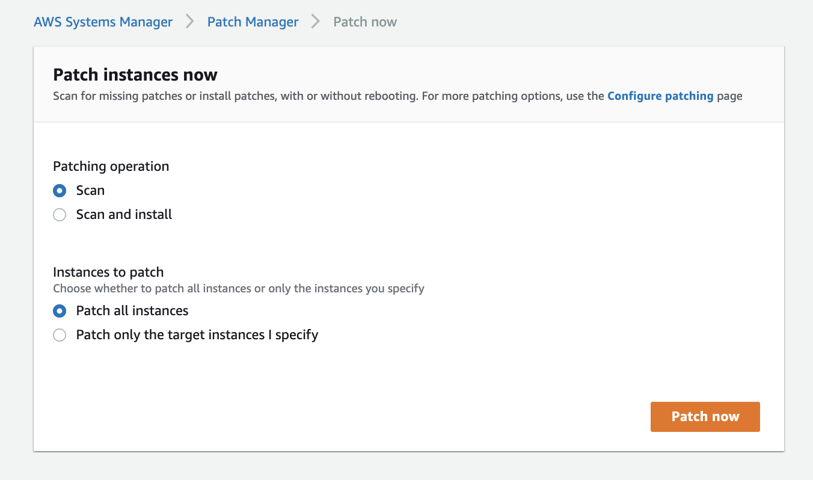
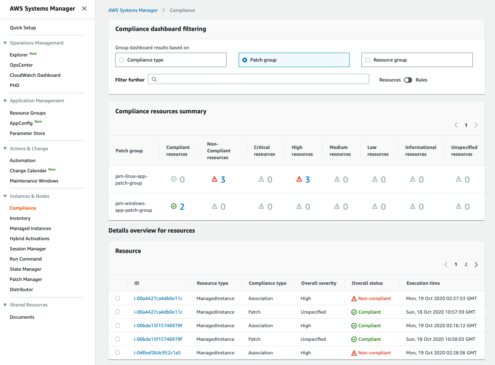

+++
title = "Review compliance"
date = 2020-08-23T15:17:40+10:00
draft = false

tags = ["AWS Systems Manager", "Detective Controls"]
categories = ["Beginner"]

# Set the page as a chapter, changing the way it's displayed
chapter = false

# provides a flexible way to handle order for your pages.
weight = 3
# Table of content (toc) is enabled by default. Set this parameter to true to disable it.
# Note: Toc is always disabled for chapter pages
disableToc = "false"
# If set, this will be used for the page's menu entry (instead of the `title` attribute)
menuTitle = ""
# The title of the page in menu will be prefixed by this HTML content
pre = ""
# The title of the page in menu will be postfixed by this HTML content
post = ""
# Hide a menu entry by setting this to true
hidden = false
# Display name of this page modifier. If set, it will be displayed in the footer.
LastModifierDisplayName = ""
# Email of this page modifier. If set with LastModifierDisplayName, it will be displayed in the footer
LastModifierEmail = ""
+++

Now that you have set the patching baseline for your two patch groups (```jam-windows-app-patch-group``` and ```jam-linux-app-patch-group```) you have something to compare against. You now need to determine the effectiveness of the current manual patching controls. To do this you will identify the number of non-compliant resources.

#### 1. Run Patch Manager Scan
From Patch Manager select Patch Now


Click 

#### 2. Scan Instances
Run Patch Manager to Scan only.  


You will see the progress tracked on screen, wait for a couple on minutes for the scan to complete.

#### 2. Review Compliance
Use AWS Systems Manager - **Compliance** to view the compliant and non-compliant resource. 

Go to the Compliance screen in Systems Manager, you will see a screen similar to the below. However the number of compliant and non-compliant instances my vary.

