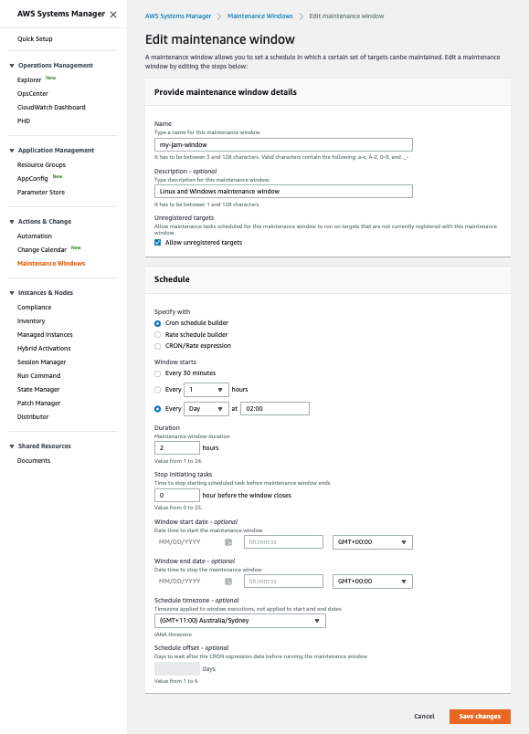

+++
title = "Create a Maintenance Window"
date = 2020-08-23T15:17:40+10:00
draft = false

tags = ["AWS Systems Manager", "Detective Controls"]
categories = ["Beginner"]

# Set the page as a chapter, changing the way it's displayed
chapter = false

# provides a flexible way to handle order for your pages.
weight = 4
# Table of content (toc) is enabled by default. Set this parameter to true to disable it.
# Note: Toc is always disabled for chapter pages
disableToc = "false"
# If set, this will be used for the page's menu entry (instead of the `title` attribute)
menuTitle = ""
# The title of the page in menu will be prefixed by this HTML content
pre = ""
# The title of the page in menu will be postfixed by this HTML content
post = ""
# Hide a menu entry by setting this to true
hidden = false
# Display name of this page modifier. If set, it will be displayed in the footer.
LastModifierDisplayName = ""
# Email of this page modifier. If set with LastModifierDisplayName, it will be displayed in the footer
LastModifierEmail = ""
+++

AWS Systems Manager [Maintenance Windows](https://docs.aws.amazon.com/systems-manager/latest/userguide/systems-manager-maintenance.html) let you define a schedule for when to perform potentially disruptive actions on your instances such as patching an operating system, updating drivers, or installing software or patches. These may require Systems Manager to perform a restart so these actions should be scheduled appropriately.

Create a maintenance window which you will use to patch the Windows and Amazon Linux 2 instances. The details of the maintenance window details such as time, duration, frequency are all up to you.

To create a maintenance window goto **Maintenance Windows** on the Systems Manager navigation pane.

You can then set the **Name** and **Description** of your maintenance window to whatever you like, noting the valid characters.

To set the Schedule uss the Cron schedule builder, but you can set schedule details as you wish.

Once you satisfied with your maintenance window click Save changes.