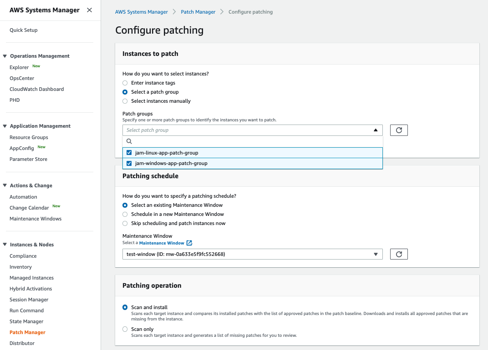

+++
title = "Create Patch Manager configuration"
date = 2020-08-23T15:17:40+10:00
draft = false

tags = ["AWS Systems Manager", "Detective Controls"]
categories = ["Beginner"]

# Set the page as a chapter, changing the way it's displayed
chapter = false

# provides a flexible way to handle order for your pages.
weight = 7
# Table of content (toc) is enabled by default. Set this parameter to true to disable it.
# Note: Toc is always disabled for chapter pages
disableToc = "false"
# If set, this will be used for the page's menu entry (instead of the `title` attribute)
menuTitle = ""
# The title of the page in menu will be prefixed by this HTML content
pre = ""
# The title of the page in menu will be postfixed by this HTML content
post = ""
# Hide a menu entry by setting this to true
hidden = false
# Display name of this page modifier. If set, it will be displayed in the footer.
LastModifierDisplayName = ""
# Email of this page modifier. If set with LastModifierDisplayName, it will be displayed in the footer
LastModifierEmail = ""
+++

Now that you have setup the patch baselines and the maintenance window there is one final task to configure Patch Manager to automatically apply patches as per your schedule. 

Configure Patch Manager to apply patched to both of your patch groups during the maintenance window you set up in the previous task.

From the Patch Manager console choose Configure patching. 

Complete the Patch manager configuration by selecting the two patch groups, the maintenance schedule you created earlier, and selecting **Scan and install**, then click **Configure patching**.

