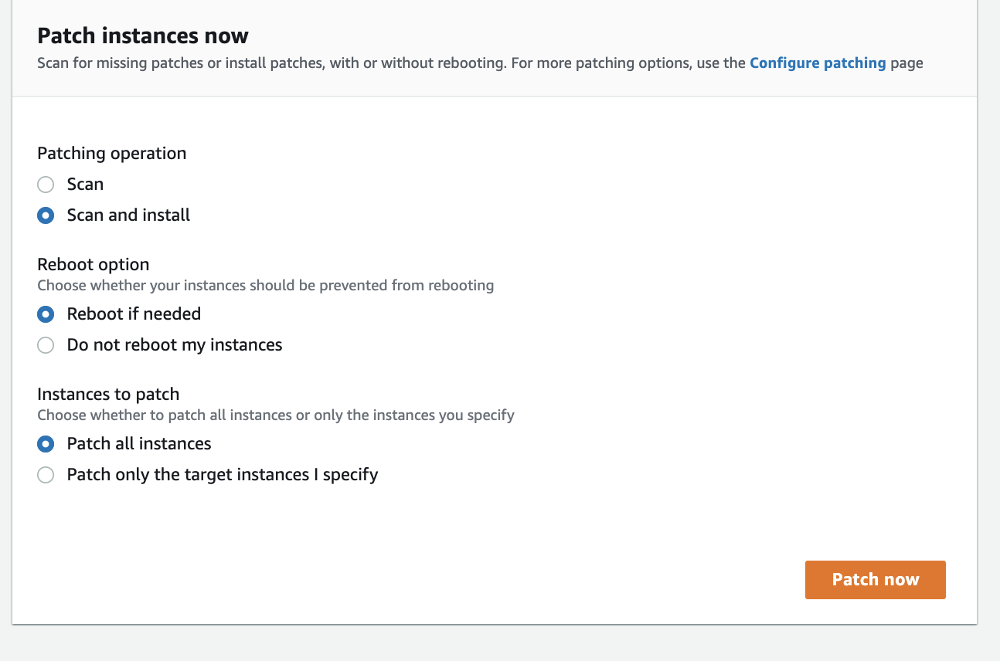
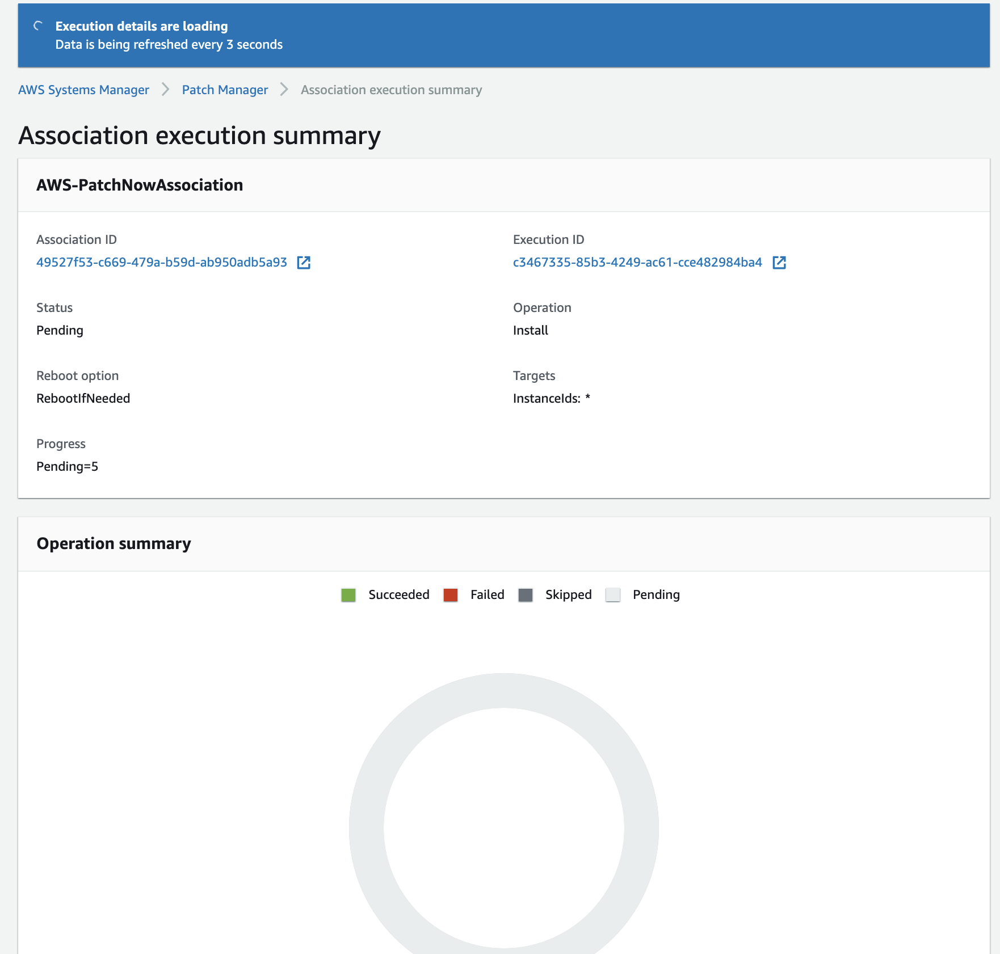

+++
title = "Patch Now"
date = 2020-08-23T15:17:40+10:00
draft = false

# Set the page as a chapter, changing the way it's displayed
chapter = false

# provides a flexible way to handle order for your pages.
weight = 7
# Table of content (toc) is enabled by default. Set this parameter to true to disable it.
# Note: Toc is always disabled for chapter pages
disableToc = "false"
# If set, this will be used for the page's menu entry (instead of the `title` attribute)
menuTitle = ""
# The title of the page in menu will be prefixed by this HTML content
pre = ""
# The title of the page in menu will be postfixed by this HTML content
post = ""
# Hide a menu entry by setting this to true
hidden = false
# Display name of this page modifier. If set, it will be displayed in the footer.
LastModifierDisplayName = ""
# Email of this page modifier. If set with LastModifierDisplayName, it will be displayed in the footer
LastModifierEmail = ""
+++

Your final step is to patch the instances in your environment now so you can see the results in the **Compliance**

From the Patch Manager console select 

Click 

Update the options as per below, including **Scan and Install** and **Reboot if needed**.

Click 

The patch progress screen will be displayed.

It may take awhile to update as Patch Manager applies all the required operating system and agent updates. This screen will automatically update as the patching operation progresses.

{}
Congratulations! You have successfully completed this workshop.
{}