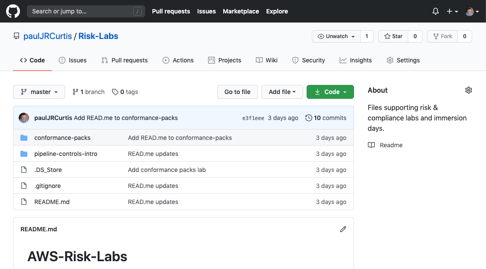
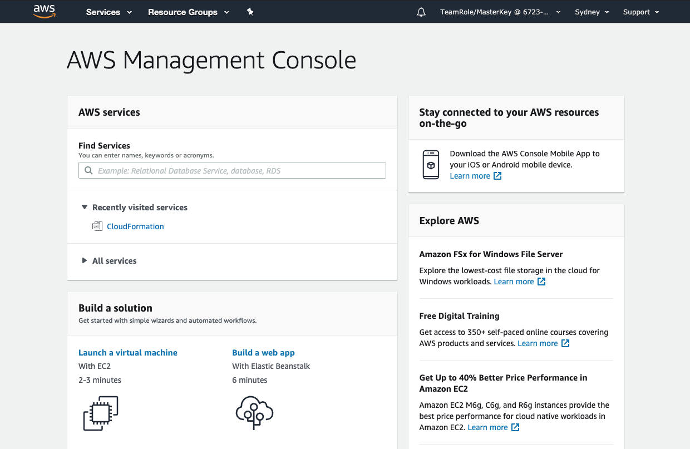
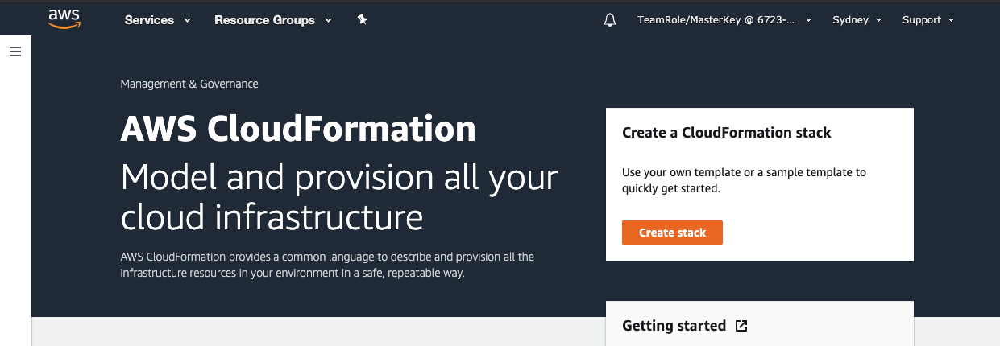
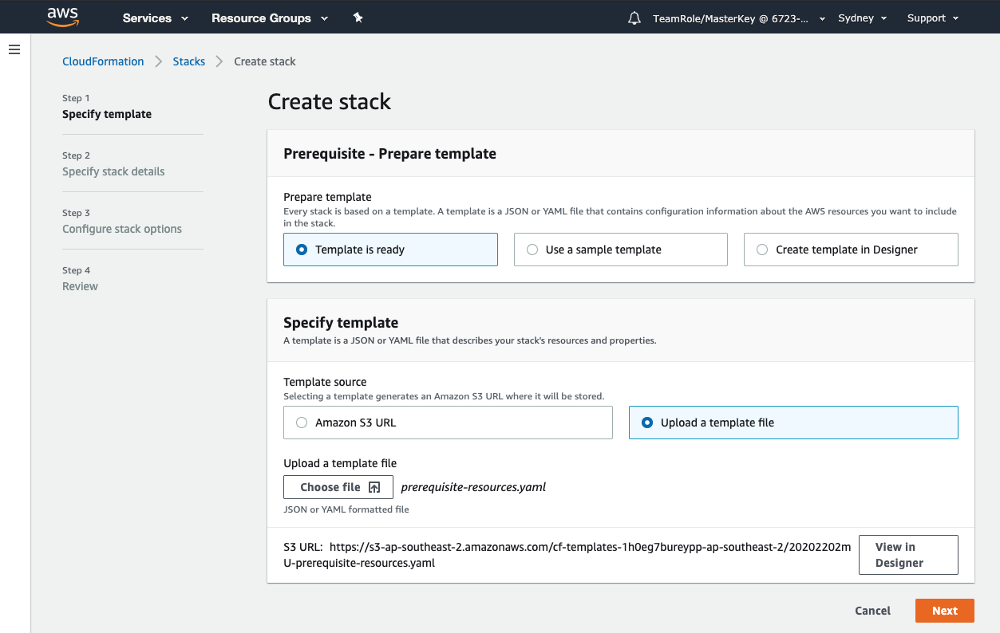
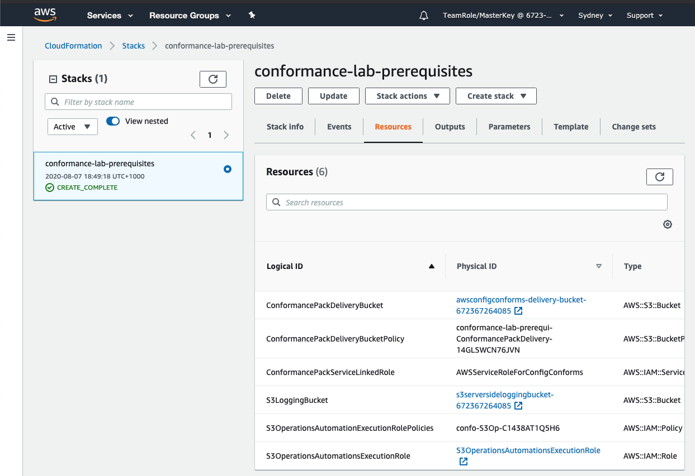

+++
title = "Setup Prerequisite Resources"
date = 2020-08-07T09:39:01+10:00
draft = false

# Set the page as a chapter, changing the way it's displayed
chapter = false

# provides a flexible way to handle order for your pages.
weight = 200
# Table of content (toc) is enabled by default. Set this parameter to true to disable it.
# Note: Toc is always disabled for chapter pages
disableToc = "false"
# If set, this will be used for the page's menu entry (instead of the `title` attribute)
menuTitle = ""
# The title of the page in menu will be prefixed by this HTML content
pre = "<b>2. </b>"
# The title of the page in menu will be postfixed by this HTML content
post = ""
# Hide a menu entry by setting this to true
hidden = false
# Display name of this page modifier. If set, it will be displayed in the footer.
LastModifierDisplayName = ""
# Email of this page modifier. If set with LastModifierDisplayName, it will be displayed in the footer
LastModifierEmail = ""
+++

We will create prerequisite resources required for “Amazon S3 Operational Best Practices with Remediation Actions” conformance pack. This includes service linked role for Conformance Packs, Remediation action automation assume role and S3 Service Side logging bucket.

**1. Download required templates template**  

The files we'll be using are available on github [Risk-Labs](https://github.com/paulJRCurtis/Risk-Labs). For this lab we'll be using the files in the conformance-packs directory, There are three files but you can disregard the  file.

The two files we'll be using are;
-   
This is the CloudFormation script to create the resources that we will need to run the conformance pack.  
-   
This is the script that contains the AWS Config rules and the remediation scripts.  

If you have [git](https://git-scm.com/book/en/v2/Getting-Started-Installing-Git) installed you can simply clone the repository, otherwise you can download a zip file containing the files by clicking  and then unzip the file into a local working directory.  Either way the risk labs code repository is on [Github repo](https://github.com/paulJRCurtis/Risk-Labs).

**2. Login to your AWS Account**
If you haven't already logon to your AWS account  

**3. Go CloudFormation**  
Take the time (3:01) to watch the short video describing CloudFormation.



From the AWS Management Console, select Services in the top left and select CloudFormation under Management and Governance.

Click .

Under **Prerequisite - prepare template**, ensure "Template is ready" is selected.

Under **Specify template**, select **Upload a template file** and click  button.  
Select the CloudFormation template  downloaded in Step 1.  
Click 

**4. Enter a Stack name**  
Something like "conformance-lab-prerequisites" makes sense but it can be whatever you like.  
Click 

**5. Configure stack options**  
Leave all defaults on the Configure stack options page and click 

**6. Review stack**
In the Capabilities section at the bottom of the page, check the check box I acknowledge that AWS CloudFormation might create IAM resources with custom names.  

Click 

**7. Stack creation complete**  
Once the deployment of the stack has completed you will see  on the left-hand side under **Stacks**.  Take some time to explore the tabs, particularly the **Events** and *Resources* tabs.
