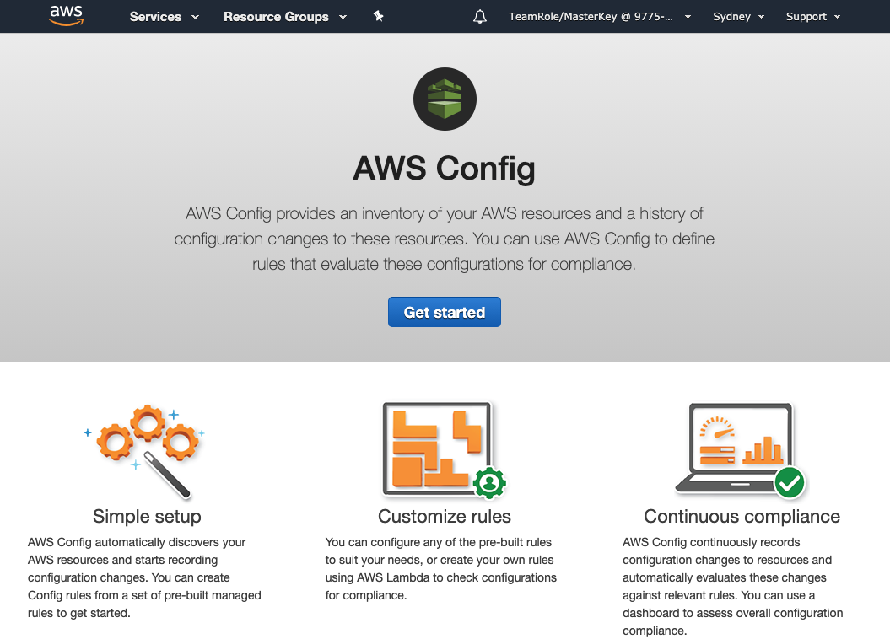
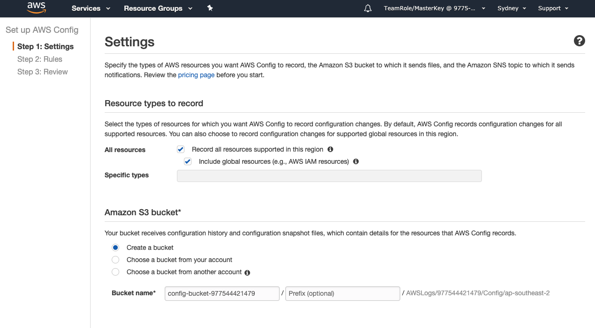
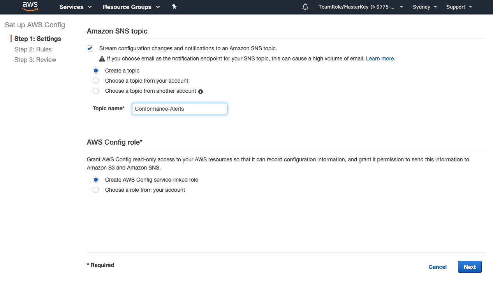

+++
title = "Enable AWS Config"
date = 2020-08-07T09:39:18+10:00
draft = false

# Set the page as a chapter, changing the way it's displayed
chapter = false

# provides a flexible way to handle order for your pages.
weight = 300
# Table of content (toc) is enabled by default. Set this parameter to true to disable it.
# Note: Toc is always disabled for chapter pages
disableToc = "false"
# If set, this will be used for the page's menu entry (instead of the `title` attribute)
menuTitle = ""
# The title of the page in menu will be prefixed by this HTML content
pre = "<b>3. </b>"
# The title of the page in menu will be postfixed by this HTML content
post = ""
# Hide a menu entry by setting this to true
hidden = false
# Display name of this page modifier. If set, it will be displayed in the footer.
LastModifierDisplayName = ""
# Email of this page modifier. If set with LastModifierDisplayName, it will be displayed in the footer
LastModifierEmail = ""
+++

We need to enable AWS Config and begin tracking of your resources.

#### 1. Access the AWS Config Console ####
Select the Services dropdown on the menu bar at the top left. Select Config under **Management & Governance**.  

**If this is your first time using AWS Config**  
select . 



**If you’ve already used AWS Config**
select Settings**


#### 2. Select Resources to track ####  
On the Settings page, under **Resource types to record**, select Record all resources supported in this region checkbox and check the checkbox for Include global resources.


Checking these two boxes means that AWS Config will record configuration changes for all supported resources all resources as well as configuration changes for AWS Identity and Access Management (IAM) resources which are global resources. Global resources are not tied to an individual region and can be used in all regions. 

#### 3. Create a Bucket for configuration History ####
AWS Config needs a place to store configuration history and configuration snapshot files, we will use [Amazon Simple Storage Service (Amazon S3)](https://aws.amazon.com/s3/) to provide this storage space - what AWS calls an S3 Bucket.   
Under **Amazon S3 bucket**, select Create a bucket to have the Amazon S3 bucket created automatically.  

#### 4. Set-up Notifications ####
Optional - Under **Amazon SNS topic**, check the box for Stream configuration changes and notifications to an Amazon SNS topic, and then select Create a topic, and give the SNS Topic a name. Something like ```AWS-Config-Alerts```, or what ever you like.  



This will enable AWS Config to send us configuration changes and notifications via [Amazon Simple Notification Service (SNS)](https://aws.amazon.com/sns/)

#### 5. Check AWS Config access ####
There is no need to change any settings in this section, Create AWS Config service-linked role should already be selected.

{}
It is worth taking a moment to understand that for AWS Config to access other services like S3 and SNS we need to grant it permissions. This step crates a role for Config that will allow Config to access the S3 bucket and the SNS topic we set-up in the steps above.
{}

Click .  

Click  again.

Click  to go to Review page and Click .  

You can now progress to the next step.
