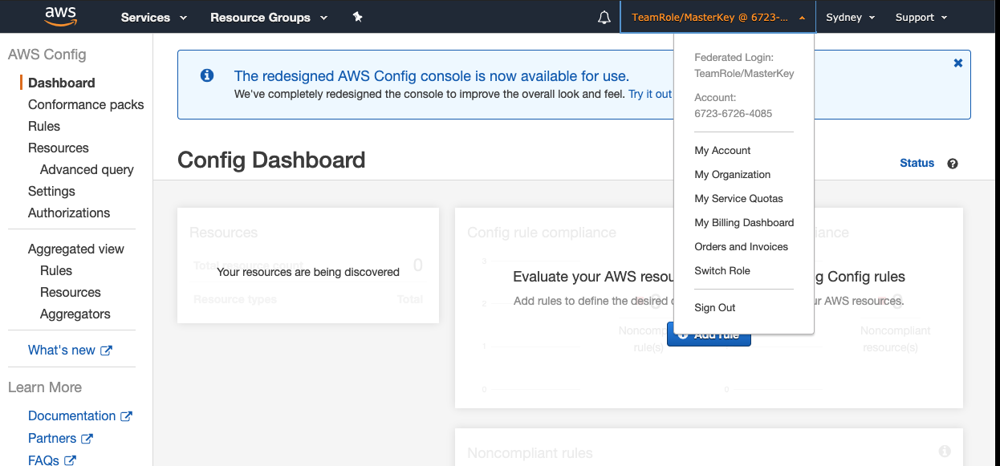
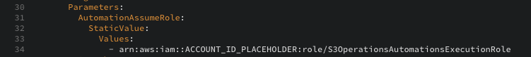
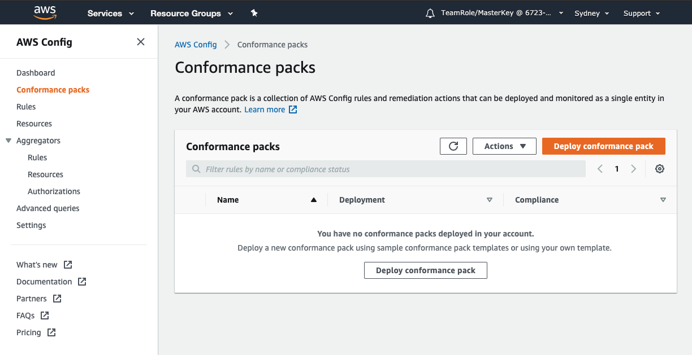
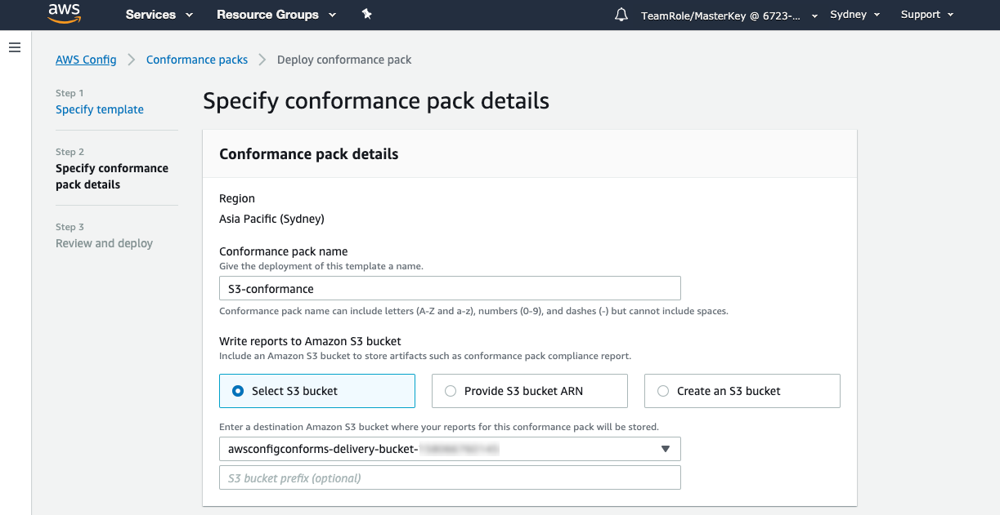
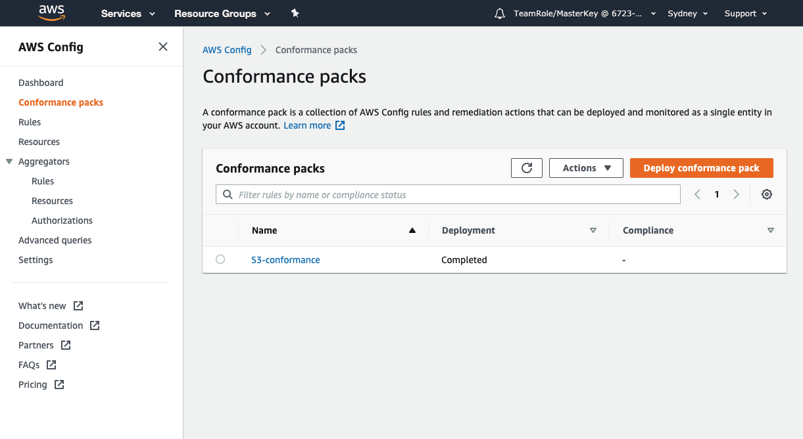

+++
title = "Deploy Conformance Pack"
date = 2020-08-07T09:39:34+10:00
draft = false

# Set the page as a chapter, changing the way it's displayed
chapter = false

# provides a flexible way to handle order for your pages.
weight = 400
# Table of content (toc) is enabled by default. Set this parameter to true to disable it.
# Note: Toc is always disabled for chapter pages
disableToc = "false"
# If set, this will be used for the page's menu entry (instead of the `title` attribute)
menuTitle = ""
# The title of the page in menu will be prefixed by this HTML content
pre = "<b>4. </b>"
# The title of the page in menu will be postfixed by this HTML content
post = ""
# Hide a menu entry by setting this to true
hidden = false
# Display name of this page modifier. If set, it will be displayed in the footer.
LastModifierDisplayName = ""
# Email of this page modifier. If set with LastModifierDisplayName, it will be displayed in the footer
LastModifierEmail = ""
+++

We will deploy the custom conformance pack which is similar to the sample template "Operational Best Practices for S3" but it includes some remediation.

1. In a text editor, open the  that you downloaded in [Step 2 - Setup Prerequisite Resources](/conformance-packs/setup-prerequisite-resources/).  
You will need to note your account ID can find by clicking on the dropdown beside your account name on the top menubar.

Replace “ACCOUNT_ID_PLACEHOLDER” on line 34, 71, 130 and 170 with your Account Id.

{}
Enter the Account ID as a number only - with no dashes. 
{}

Don't forget to save your changes.

2. Go to the Config Console and select Conformance Packs from left navigation panel

3. Click on  .  

4. Under template details, select **Template is ready** and under template location, select **Upload a template file** and click **Choose file** button and select  template you updated in Step 1 above.  
Click   

7. Enter a Conformance Pack Name, something like "S3-conformance-pack" makes sense but you can name it whatever you like.  

8. Choose "Select S3 Bucket" and select the S3 Bucket named awsconfigconforms-delivery-bucket-{YOUR-AWS-ACCOUNT-ID}. This bucket was created as part of prerequisite cloudformation template in previous section.

9. Under parameter, click on Add Parameter. Enter the Key as S3TargetBucketNameForEnableLogging and Parameter Value as s3serversideloggingbucket-{YOUR-AWS-ACCOUNT-ID} (again do not include any dashes in your account ID) and Click   

11. Click   
Deploying the Conformance Pack may take a few minutes.
