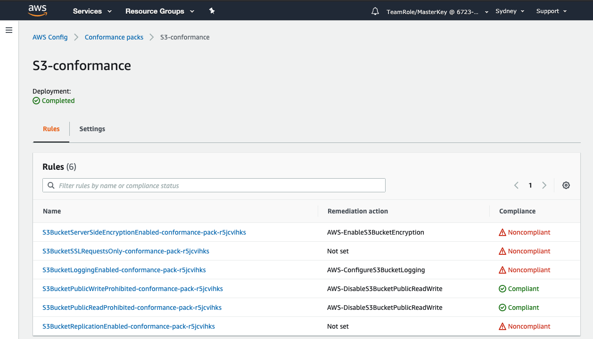
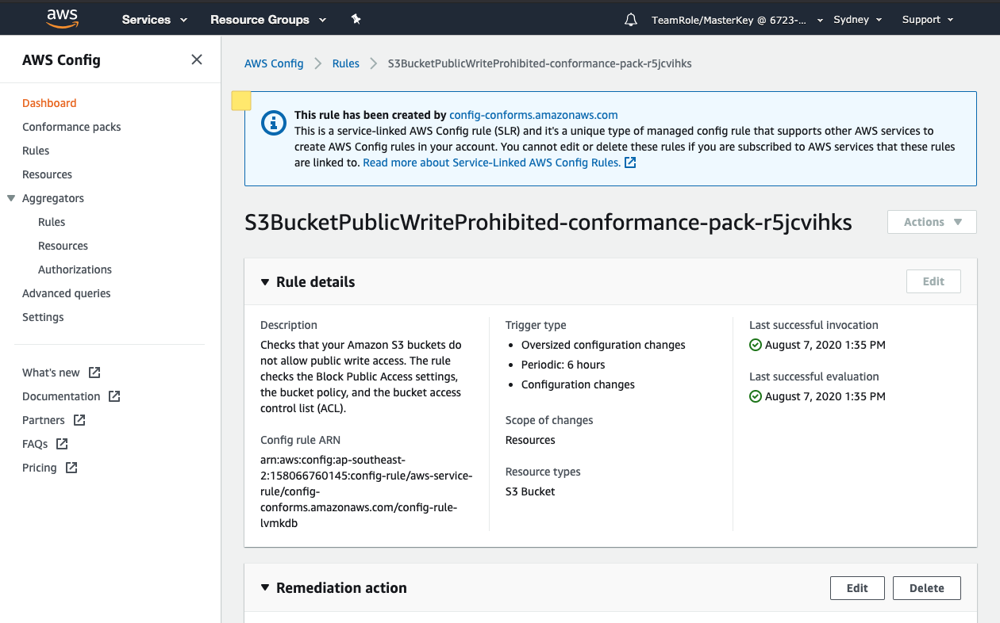

+++
title = "View Compliance and Remediation"
date = 2020-08-07T09:39:57+10:00
draft = false

# Set the page as a chapter, changing the way it's displayed
chapter = false

# provides a flexible way to handle order for your pages.
weight = 500
# Table of content (toc) is enabled by default. Set this parameter to true to disable it.
# Note: Toc is always disabled for chapter pages
disableToc = "false"
# If set, this will be used for the page's menu entry (instead of the `title` attribute)
menuTitle = ""
# The title of the page in menu will be prefixed by this HTML content
pre = "<b>5. </b>"
# The title of the page in menu will be postfixed by this HTML content
post = ""
# Hide a menu entry by setting this to true
hidden = false
# Display name of this page modifier. If set, it will be displayed in the footer.
LastModifierDisplayName = ""
# Email of this page modifier. If set with LastModifierDisplayName, it will be displayed in the footer
LastModifierEmail = ""
+++

We will check compliance status for each rule in conformance pack and associated resources

1. Once conformance pack is deployed, Click on conformance pack name to drill down into details. You can view list of rules and their compliance status.

2. Click on a rule name to see rule details.

3. Expand Resources in Scope section to see resources in scope and their compliance status. If there are any existing non-compliant resources, you can manually remediate them or wait for auto-remediation to kick in.
4. To see auto-remediation in action on a new resource, create a new s3 bucket using S3 Console. AWS Config will discover the resource and mark it as non-compliant if it is not following S3 Best Practices.
5. Go back to Conformance Pack details and select a rule with remediation action.
6. Expand Resources in Scope section to see newly created resource with its compliance status. If the resource is non-compliant, auto-remediation action will apply to resource within few minutes.
7. Refresh the page to see updated resource compliance status.
8. You can also manually remediate a resource by selecting resource and clicking Remediate.  
9. Take some time to explore the rest of the Config pages and dashboards outside of conformance packs.
