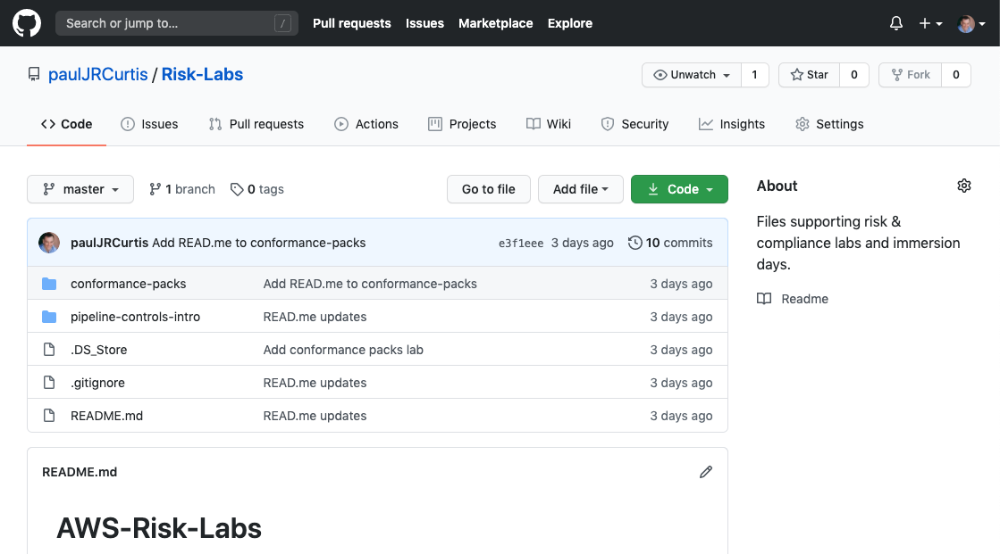

+++
title = "Get Source Files"
date =  2020-08-03T13:02:59+10:00
draft = false

# Set the page as a chapter, changing the way it's displayed
chapter = false

# provides a flexible way to handle order for your pages.
weight = 100
# Table of content (toc) is enabled by default. Set this parameter to true to disable it.
# Note: Toc is always disabled for chapter pages
disableToc = "false"
# If set, this will be used for the page's menu entry (instead of the `title` attribute)
menuTitle = ""
# The title of the page in menu will be prefixed by this HTML content
pre = "<b>1. </b>"
# The title of the page in menu will be postfixed by this HTML content
post = ""
# Hide a menu entry by setting this to true
hidden = false
# Display name of this page modifier. If set, it will be displayed in the footer.
LastModifierDisplayName = ""
# Email of this page modifier. If set with LastModifierDisplayName, it will be displayed in the footer
LastModifierEmail = ""
+++

{}
If you have already downloaded the risk kab source files you can skip this step.
{}

The very first thing we need to do is get the source files we will be using for this lab.

The files we'll be using are available on github [Risk-Labs](https://github.com/paulJRCurtis/Risk-Labs). For this lab we'll be using the files in the pipeline-controls-intro directory, There are five files but you can disregard the  file.

The four files we'll be using are;
-   
This is the CloudFormation script to create two [Amazon Virtual Private Clouds](https://aws.amazon.com/vpc/) (VPCs), one for our test environment and one for our production environment.    
-   
This is the CloudFormation script that will build our AWS CodePipeline.
-   
This file contains the CloudFormation scripts that is the change we are testing. It is a simple security group - A security group acts as a virtual firewall for your instance to control inbound and outbound traffic, and in this lab we are going to make sure it is not open to the world before we allow it into production.  
-   
This file contains the code the code pipeline will run to execute the test against our change.

If you have [git](https://git-scm.com/book/en/v2/Getting-Started-Installing-Git) installed you can simply clone the repository, otherwise you can download a zip file containing the files and unzip it into a local working directory.

To download a zip file with the code for this and the other labs in this series, click on the  and choose **Download ZIP**.