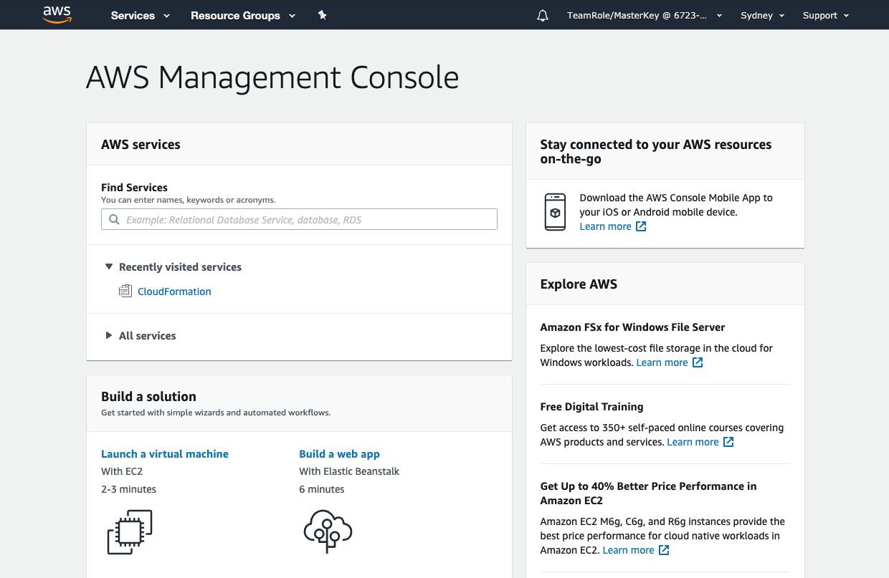

+++
title = "Create Repo Bucket"
date =  2020-08-03T13:17:25+10:00
draft = false

# Set the page as a chapter, changing the way it's displayed
chapter = false

# provides a flexible way to handle order for your pages.
weight = 200
# Table of content (toc) is enabled by default. Set this parameter to true to disable it.
# Note: Toc is always disabled for chapter pages
disableToc = "false"
# If set, this will be used for the page's menu entry (instead of the `title` attribute)
menuTitle = ""
# The title of the page in menu will be prefixed by this HTML content
pre = "<b>2. </b>"
# The title of the page in menu will be postfixed by this HTML content
post = ""
# Hide a menu entry by setting this to true
hidden = false
# Display name of this page modifier. If set, it will be displayed in the footer.
LastModifierDisplayName = ""
# Email of this page modifier. If set with LastModifierDisplayName, it will be displayed in the footer
LastModifierEmail = ""
+++

For this lab we are going to use an [Amazon S3](https://aws.amazon.com/s3/) bucket as our code repository. S3 provides all the functionality we need and doesn't require us to manage "commits" that code repositories do, however you could use [AWS CodeCommit](https://aws.amazon.com/codecommit/) or Git. Create your own S3 bucket in the desired region and enable versioning on the bucket.  

**1. Log on to the AWS Console**  

**2. Select the Services dropdown in the top left or search for S3.**  
**3. Create a bucket**  

Select   
Give your bucket a name, something that will indicate that it's your code repository is good but you can call it whatever you like.

{}
Amazon S3 has a global namespace. (i.e. No two S3 buckets can have the same name.) Therefore, you need to use a unique bucket name when creating S3 buckets. Before you start creating S3 buckets, it's important to first understand valid syntax for bucket names as well as best practices.
Bucket names should be lower-case, use '-' rather than spaces and should not include '.' or '_'.
{}  

Click   

On the Properties page turn on Versioning by selecting the checkbox and click  again.  

The next screen shows you the buckets public access settings, as you can see all public access is blocked by default.  Leave these settings as they are and click  

Finally, click   

**4. Upload files to S3**  
Copy the following files that you downloaded in the previous step to the new S3 Bucket;
-   
-   
-   

Click on the name of your new bucket and then click . You can now drag and drop the files listed above to the bucket.

**5. Copy the Object URL**  
Copy the Object URLs for the  and  objects - we will need them in the following steps.  To do this simply click on the file name and note the **Object URL** at the bottom of the screen.

