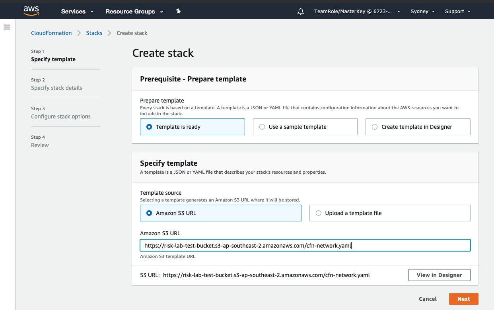
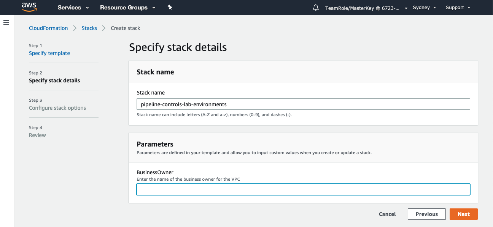
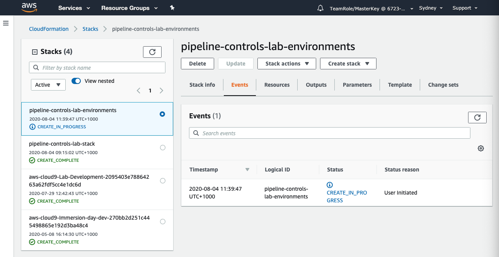
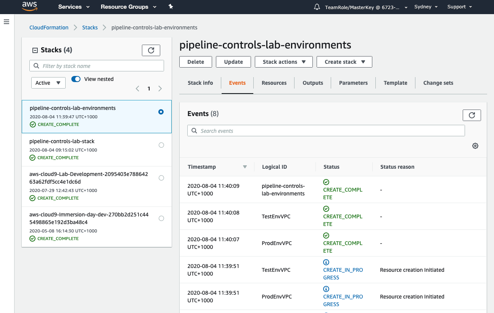

+++
title = "Create Environments"
date =  2020-08-03T09:22:52+10:00
draft = false

# Set the page as a chapter, changing the way it's displayed
chapter = false

# provides a flexible way to handle order for your pages.
weight = 300
# Table of content (toc) is enabled by default. Set this parameter to true to disable it.
# Note: Toc is always disabled for chapter pages
disableToc = "false"
# If set, this will be used for the page's menu entry (instead of the `title` attribute)
menuTitle = ""
# The title of the page in menu will be prefixed by this HTML content
pre = "<b>3. </b>"
# The title of the page in menu will be postfixed by this HTML content
post = ""
# Hide a menu entry by setting this to true
hidden = false
# Display name of this page modifier. If set, it will be displayed in the footer.
LastModifierDisplayName = ""
# Email of this page modifier. If set with LastModifierDisplayName, it will be displayed in the footer
LastModifierEmail = ""
+++

In this step we will create two [Amazon Virtual Private Clouds](https://aws.amazon.com/vpc/) (VPCs) to represent our Testing and Development environments. A VPC is the basic building block for a network on AWS.

We could create the VPCs on the AWS console but it is better practice to deploy our pipeline using [AWS CloudFormation Page](https://aws.amazon.com/cloudformation/).

**1. Open CloudFormation in the AWS Console**  
Take the time (3:01) to watch the short video describing CloudFormation if you haven't already seen in.



Select Services on the menu bar at the top of the page and select CloudFormation under **Management & Governance**.  

**2. Select network CloudFormation script**  
First, make sure you're in the right region.  

Then 

Select **Template is ready** and **Amazon S3 URL**
Specify the template by selecting Amazon S3 URL as the source and paste in the Object URL for the  file you copied in the previous step.
  

Click 

CloudFormation will now ask you to enter a **StackName** and **BusinessOwner**. For the StackName enter something like pipeline-controls-lab-environments. CloudFormation also asks for a business owner, It does this because we have set BusinessOwner as a Tag in our CloudFormation script.  Tagging resources is an important part of managing resources. 

{}
Amazon Web Services allows customers to assign metadata to their AWS resources in the form
of tags. Each tag is a simple label consisting of a customer-defined key and an optional value
that can make it easier to manage, search for, and filter resources. Although there are no
inherent types of tags, they enable customers to categorize resources by purpose, owner,
environment, or other criteria.  

Without the use of tags, it can become difficult to manage your resources effectively as your
utilization of AWS services grows. However, it is not always evident how to determine what
tags to use and for which types of resources. The goal of this whitepaper is to help you develop
a tagging strategy that enables you to manage your AWS resources more effectively.  

[AWS Whitepaper - Tagging Best Practice](https://d1.awsstatic.com/whitepapers/aws-tagging-best-practices.pdf)

{}

Enter your name as the Business Owner and click 

There is no need to change anything on the next page, scroll to the bottom and click .

Scroll to the bottom of the final page and click .

When the stack has been deployed you will see  on the left-hand panel. Click the refresh button to see the events.
