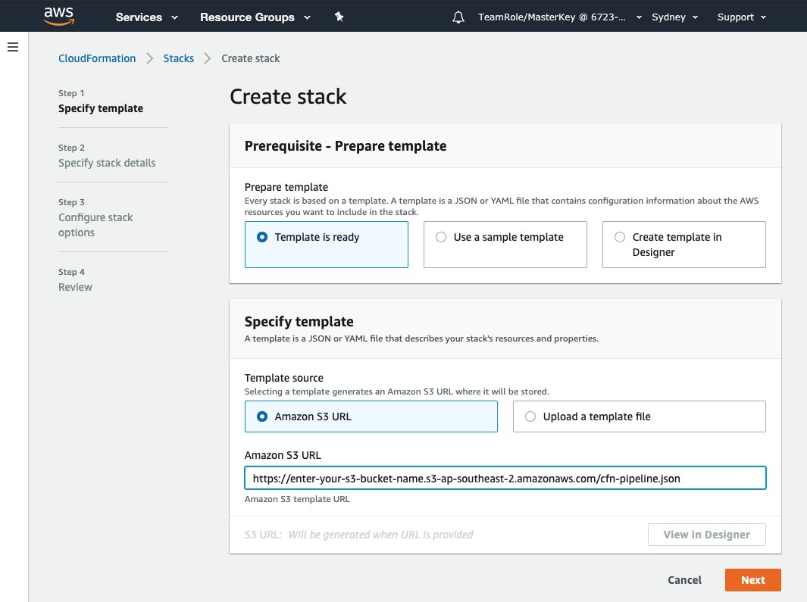
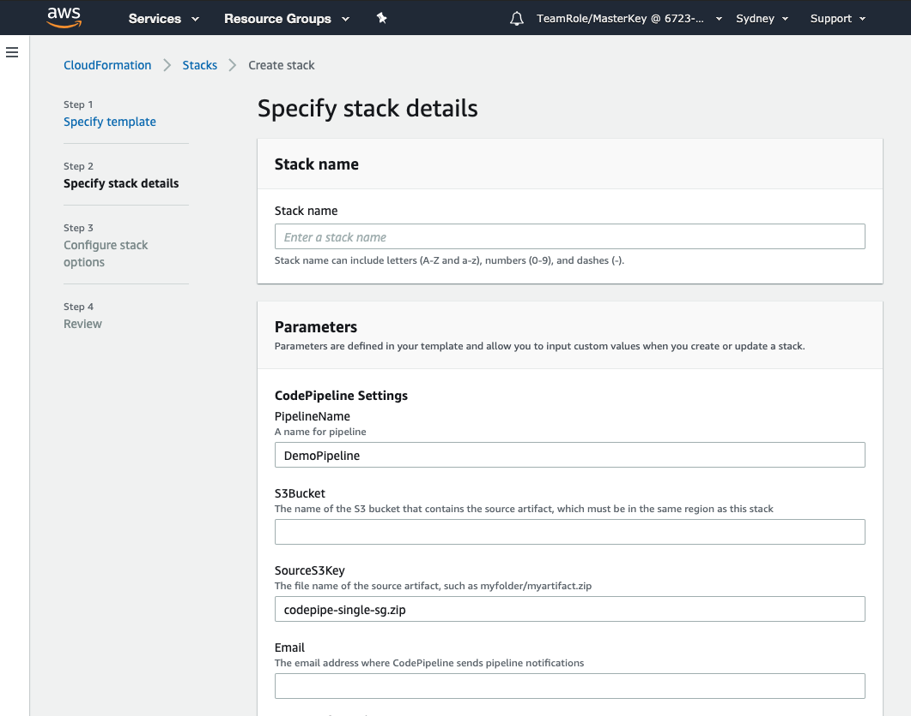
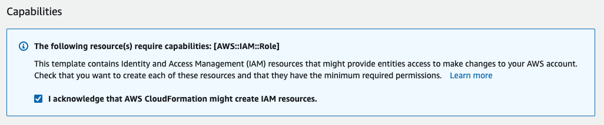

+++
title = "Create a Pipeline"
date =  2020-08-02T12:45:03+10:00
draft = false

# Set the page as a chapter, changing the way it's displayed
chapter = false

# provides a flexible way to handle order for your pages.
weight = 400
# Table of content (toc) is enabled by default. Set this parameter to true to disable it.
# Note: Toc is always disabled for chapter pages
disableToc = "false"
# If set, this will be used for the page's menu entry (instead of the `title` attribute)
menuTitle = ""
# The title of the page in menu will be prefixed by this HTML content
pre = "<b>4. </b>"
# The title of the page in menu will be postfixed by this HTML content
post = ""
# Hide a menu entry by setting this to true
hidden = false
# Display name of this page modifier. If set, it will be displayed in the footer.
LastModifierDisplayName = ""
# Email of this page modifier. If set with LastModifierDisplayName, it will be displayed in the footer
LastModifierEmail = ""
+++

Now lets create the code pipeline. This will allow us to ensure all change into our production environment progress through our test environment and are pass the required checks.

Our code pipeline will be made up of four stages;
1. Commit
2. Static Code Analysis
3. Test Deployment
4. Production Deployment

Like the VPCs, we could create the pipeline on the AWS console but just like everything else on the AWS Platform a code pipeline is defined by code so we will adhere to good practive and and deploy our pipeline using [AWS Cloud Formation](https://aws.amazon.com/cloudformation/).

**1. Select pipeline CloudFormation script**  
Go to the **Stacks** view by clicking the hamburger icon &#9776; in the top left and select Stacks.  Then click  - choose the "With new resources (standard)" option.

Select **Template is ready** and **Amazon S3 URL** then paste in the Object URL for  you copied in the previous step.

Click 

**2. Specify stack details**  
You need to provide three pieces of information;
- A stack name, something like pipeline-controls-lab-stack makes sense but you can name it anything you like.
- The name of the S3 bucket that contains the  file.  
{}
If you can't recall the bucket name you can open a second console screen by clicking **Services** on the menu bar at the top left of the screen and right clicking on S3.  Choose Open link in new tab.  then click off of the popup services menu to return to the CloudFormation screen.
{}

- Your email address, this is used to provide you with email notifications when the CodePipeline runs.
  

Click 

You will be taken to the Configure stack options screen - there is no need to make any changes on this page.  

Click 

**3. Review stack**  
As this stack provisions IAM roles you are required to acknowledge these changes by selecting the check box in the **Capabilities** box at the bottom of the page.  

Click 