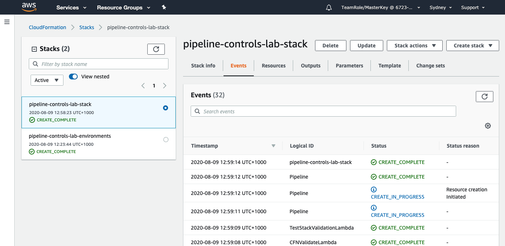
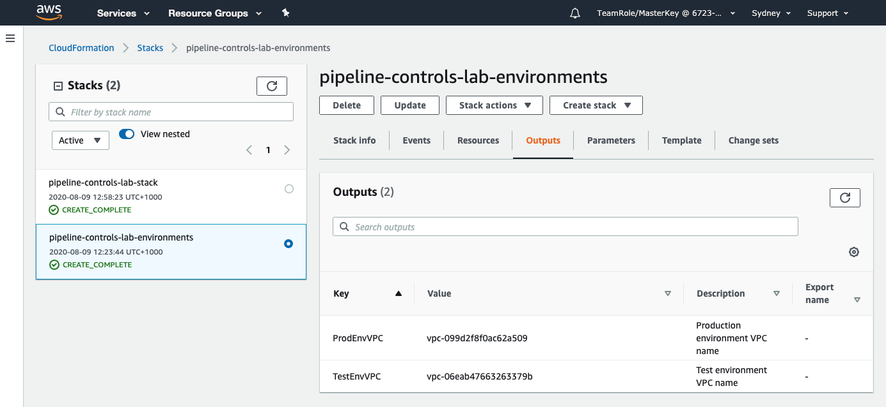

+++
title = "Check CloudFormation"
date =  2020-08-02T18:05:05+10:00
draft = false

# Set the page as a chapter, changing the way it's displayed
chapter = false

# provides a flexible way to handle order for your pages.
weight = 500
# Table of content (toc) is enabled by default. Set this parameter to true to disable it.
# Note: Toc is always disabled for chapter pages
disableToc = "false"
# If set, this will be used for the page's menu entry (instead of the `title` attribute)
menuTitle = ""
# The title of the page in menu will be prefixed by this HTML content
pre = "<b>5. </b>"
# The title of the page in menu will be postfixed by this HTML content
post = ""
# Hide a menu entry by setting this to true
hidden = false
# Display name of this page modifier. If set, it will be displayed in the footer.
LastModifierDisplayName = ""
# Email of this page modifier. If set with LastModifierDisplayName, it will be displayed in the footer
LastModifierEmail = ""
+++

You can now see the two stacks you have created on the left-hand panel.

By default the CloudFormation console will display the Events tab listing all the events which occurred as part of the CloudFormation deployment. When the CloudFormation script has completed you will see  on the left hand panel.

Switch between the two stacks and explore the other tabs, in particular review the **Resources** tab to see all the AWS resources created by the CloudFormation template.

{}
Go to the Output tab for the pipeline-controls-lab-environments and take note of the VPC name for the Test and Production Environments. You will need these in Step 7.
{}  

You should also now check your email, you will have received an email from **AWS Notifications** asking you to confirm your subscription to notifications from the pipeline. You can go ahead and confirm.