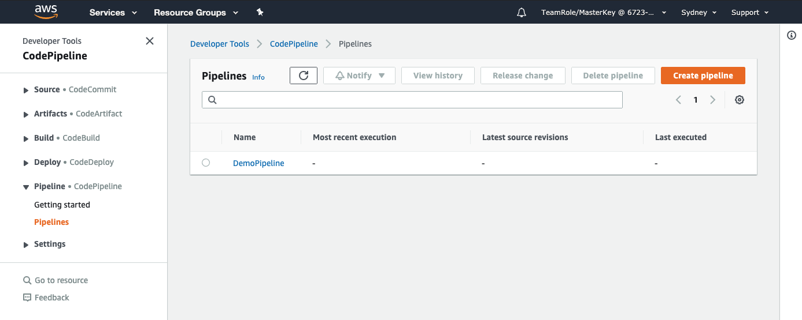
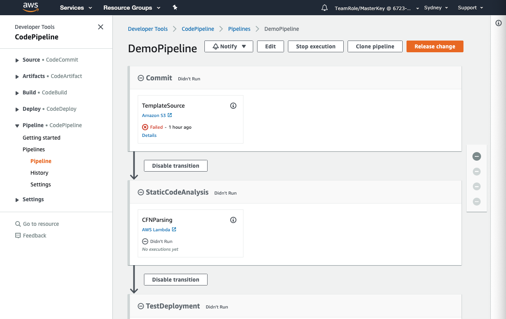

+++
title = "Review Code Pipeline"
date =  2020-08-02T18:05:32+10:00
draft = false

# Set the page as a chapter, changing the way it's displayed
chapter = false

# provides a flexible way to handle order for your pages.
weight = 600
# Table of content (toc) is enabled by default. Set this parameter to true to disable it.
# Note: Toc is always disabled for chapter pages
disableToc = "false"
# If set, this will be used for the page's menu entry (instead of the `title` attribute)
menuTitle = ""
# The title of the page in menu will be prefixed by this HTML content
pre = "<b>6. </b>"
# The title of the page in menu will be postfixed by this HTML content
post = ""
# Hide a menu entry by setting this to true
hidden = false
# Display name of this page modifier. If set, it will be displayed in the footer.
LastModifierDisplayName = ""
# Email of this page modifier. If set with LastModifierDisplayName, it will be displayed in the footer
LastModifierEmail = ""
+++

Go to **Services** and select CodePipeline under **Developer Tools**

Note that under "Most recent execution" nothing is shown.  This is because we haven't yet provided a change for our code pipeline to process.  

Click on the name of your pipeline to see the stages.

Again, note that the first stage has , but don't worry it is only because the code pipeline tried to run when it is first provisioned but there was no file for it to process. We'll provide a file soon. 

You should have also received and email titled "AWS Notifications", this was generated by the pipeline and will require you to confirm your subscription, which you should do now.

Congratulations, you now have a functioning code pipeline! Now lets try it out.