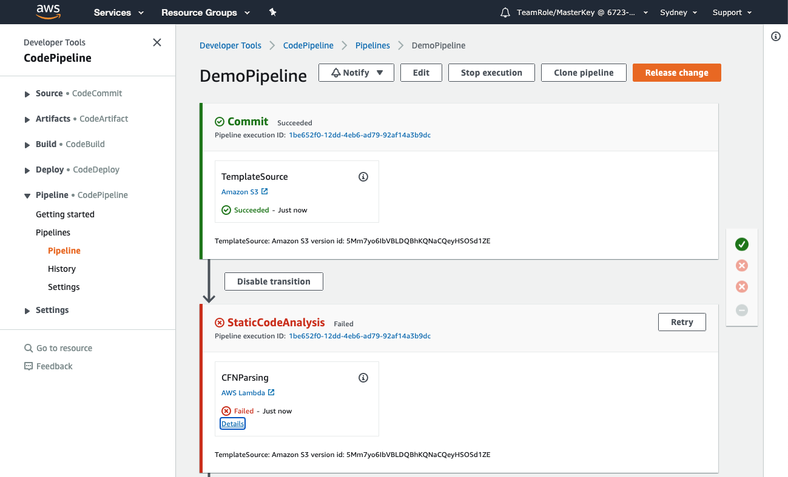
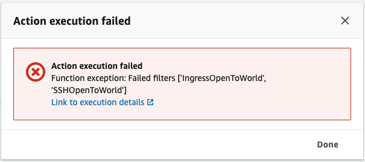
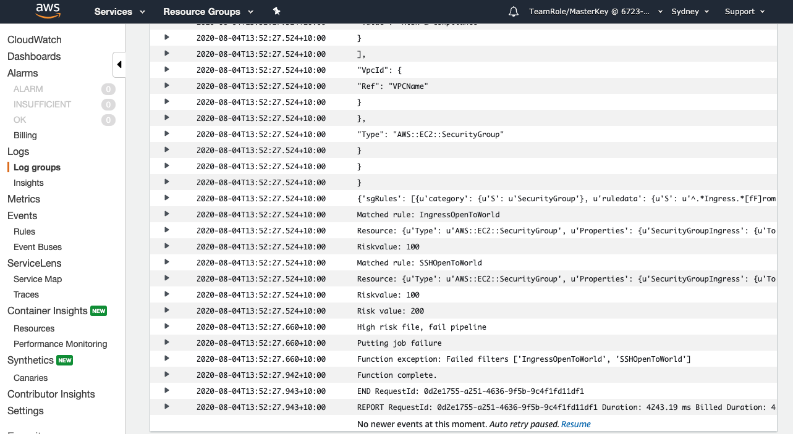

+++
title = "Deploy First Change"
date =  2020-08-04T09:17:12+10:00
draft = false

# Set the page as a chapter, changing the way it's displayed
chapter = false

# provides a flexible way to handle order for your pages.
weight = 700
# Table of content (toc) is enabled by default. Set this parameter to true to disable it.
# Note: Toc is always disabled for chapter pages
disableToc = "false"
# If set, this will be used for the page's menu entry (instead of the `title` attribute)
menuTitle = ""
# The title of the page in menu will be prefixed by this HTML content
pre = "<b>7. </b>"
# The title of the page in menu will be postfixed by this HTML content
post = ""
# Hide a menu entry by setting this to true
hidden = false
# Display name of this page modifier. If set, it will be displayed in the footer.
LastModifierDisplayName = ""
# Email of this page modifier. If set with LastModifierDisplayName, it will be displayed in the footer
LastModifierEmail = ""
+++

**1. Unzip the change file**  
In Step 1 - [Get Source Files](/risk-lab-site/pipeline-controls-intro/get-source-files/) we downloaded the source files. Go to the directory which contains these files and unzip the  file, it contains three files;
-   
This file is the main CloudFormation script for our change containing the configuration for the security group that we will deploy first into the Testing Environment, then into the Production Environment.
-   
This file includes the name of the VPC used for our testing environment.
- 
This file includes the name of the VPC used for the production environment.


**2. Review the main CloudFormation template**  
First, lets have a look at the  file.  This file creates a security group - a security group acts as a virtual firewall for your instance to control inbound and outbound traffic.  

We're not going to get into the format or structure of the file in this lab but there are a few lines that we will focus on. Where the file provides the details for the SecurityGroupIngress you can see that the CidrIp range is set to 0.0.0.0/0 and the FromPort is 22. This means that the security group is open to remote connection from any ip address - which we do not want - but lets leave it as is for now.

```json
{
  "AWSTemplateFormatVersion": "2010-09-09",
  "Description": "Sample, test only template that creates a sample Security Group allowing all SSH traffic inbound from 0.0.0.0/0 .  This template is for testing purposes only.",
  "Parameters": {
    "VPCName": {
      "Description": "ID of the existing VPC.",
      "Type": "AWS::EC2::VPC::Id"
    }
  },
  "Resources": {
    "sg": {
      "Type" : "AWS::EC2::SecurityGroup",
      "Properties" : {
        "GroupDescription" : "SSH Security Group",
        "SecurityGroupIngress" : {
          "CidrIp": "0.0.0.0/0",
          "FromPort": 22,
          "ToPort": 22,
          "IpProtocol": "tcp"
        },
		"Tags": [
			{"Key": "Name", "Value": "Immersion-Day-Demo"},
			{"Key": "LOB", "Value": "Risk-&-Compliance"}
		],
        "VpcId" : { "Ref" : "VPCName" }}
      }
  }
}
```
**3. Update the CloudFormation templates**  
Next we will update the two configuration files with the names of the VPCs we noted in Step 5 - [Check CloudFormation](/risk-lab-site/pipeline-controls-intro/5-check-cf/).

-   
Update the VPCName to the name of your test environment VPC.
- 
Update the VPCName to the name of your production environment VPC.

Your  and  files should look like this but with your vpc as the value for VPCName.
```json
{
  "Parameters" : {
    "VPCName" : "vpc-cd0dd4a9"
  }
}
```

Don't forget to save your changes.

**4. Create new  file**  
Zip up the three files into a new   

**5. Upload the CloudFormation script to the code repository bucket**  
Upload the new  file into the S3 bucket you created in Step 2 - [Create Repo Bucket](/risk-lab-site/pipeline-controls-intro/create-repo-bucket/).  

**6. Go to the Pipeline**  
The AWS CodePipeline will detect that the file is in the S3 bucket and will run automatically, or you can click on the pipeline name and click 



You can see that the StaticCodeAnalysis stage has failed, to see why click the  link just below .



You can see the execution failed due to **"Failed filters 'IngressOpenToWorld', 'SSHOpenToWorld'"**.  This is exactly the issue we saw when we reviewed the code earlier. To dive even deeper click . this will take you to [Amazon CloudWatch](https://aws.amazon.com/cloudwatch/).


