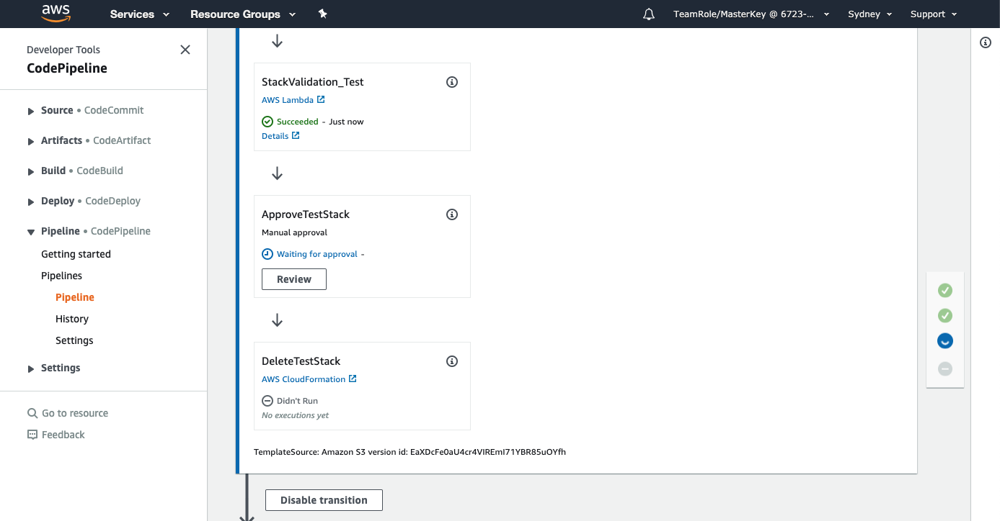

+++
title = "Edit Change & Redeploy"
date =  2020-08-04T14:56:11+10:00
draft = false

# Set the page as a chapter, changing the way it's displayed
chapter = false

# provides a flexible way to handle order for your pages.
weight = 800
# Table of content (toc) is enabled by default. Set this parameter to true to disable it.
# Note: Toc is always disabled for chapter pages
disableToc = "false"
# If set, this will be used for the page's menu entry (instead of the `title` attribute)
menuTitle = ""
# The title of the page in menu will be prefixed by this HTML content
pre = "<b>8 </b>"
# The title of the page in menu will be postfixed by this HTML content
post = ""
# Hide a menu entry by setting this to true
hidden = false
# Display name of this page modifier. If set, it will be displayed in the footer.
LastModifierDisplayName = ""
# Email of this page modifier. If set with LastModifierDisplayName, it will be displayed in the footer
LastModifierEmail = ""
+++

In this step we will secure the CloudFormation template for our Security Group and redeploy it.

**1. Edit the Security group**  
Go back to your working directory and edit the  file to a more restrictive ip range - ```72.21.196.67/32```

```json
{
  "AWSTemplateFormatVersion": "2010-09-09",
  "Description": "Sample, test only template that creates a sample Security Group allowing all SSH traffic inbound from 0.0.0.0/0 . This template is for testing purposes only.",
  "Parameters": {
    "VPCName": {
      "Description": "ID of the existing VPC.",
      "Type": "AWS::EC2::VPC::Id"
    }
  },
  "Resources": {
    "sg": {
      "Type" : "AWS::EC2::SecurityGroup",
      "Properties" : {
        "GroupDescription" : "SSH Security Group",
        "SecurityGroupIngress" : {
          "CidrIp": "72.21.196.67/32",
          "FromPort": 22,
          "ToPort": 22,
          "IpProtocol": "tcp"
        },
		"Tags": [
			{"Key": "Name", "Value": "Immersion-Day-Demo"},
			{"Key": "LOB", "Value": "Risk-&-Compliance"}
		],
        "VpcId" : { "Ref" : "VPCName" }}
      }
  }
}
```

Don't forget to change your changes.

**2. Create new  file**  
Zip up the three files into a new   

**3. Upload the CloudFormation script to the code repository**  
Upload the new  file into the S3 bucket you created in Step 2 - [Create Repo Bucket](/risk-lab-site/pipeline-controls-intro/create-repo-bucket/). There is no need to delete the old version of  from the S3 Bucket first, S3 will replace the old file.

**4. Go to the Pipeline**  
The Pipeline will detect that the new file is in the S3 bucket and will run automatically, or you can click 

**5. Approve Test Stack**  
The change should now pass the validation steps and will progress to the **ApproveTestStack** stage.  



Click  on the ApproveTestStack step in the pipeline.  

Enter a review comment and click .

Wait for the final steps of the pipeline complete which should only take a few minutes.