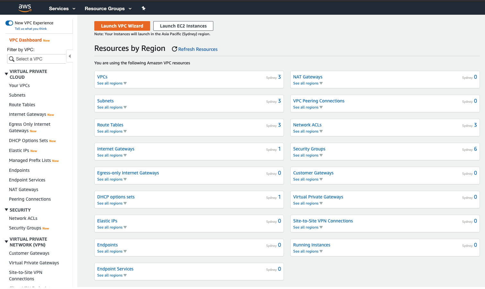
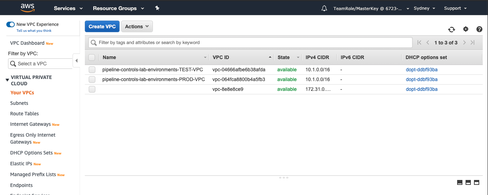
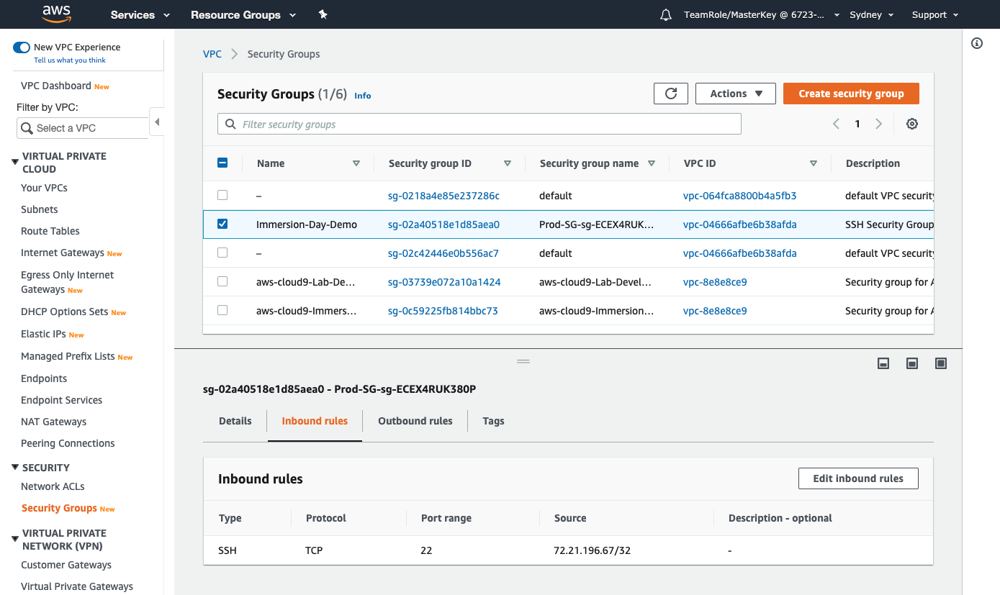

+++
title = "Review Security Group"
date =  2020-08-04T15:47:45+10:00
draft = false

# Set the page as a chapter, changing the way it's displayed
chapter = false

# provides a flexible way to handle order for your pages.
weight = 900

# Table of content (toc) is enabled by default. Set this parameter to true to disable it.
# Note: Toc is always disabled for chapter pages
disableToc = "false"
# If set, this will be used for the page's menu entry (instead of the `title` attribute)
menuTitle = ""
# The title of the page in menu will be prefixed by this HTML content
pre = "<b>9. </b>"
# The title of the page in menu will be postfixed by this HTML content
post = ""
# Hide a menu entry by setting this to true
hidden = false
# Display name of this page modifier. If set, it will be displayed in the footer.
LastModifierDisplayName = ""
# Email of this page modifier. If set with LastModifierDisplayName, it will be displayed in the footer
LastModifierEmail = ""
+++

On the console go to VPC which you'll find in the Networking & Content Delivery section.

Click on 

About halfway down the list on the left-hand side of the page you will see Security Groups - select it.

Select the checkbox beside Risk Lab Sec Group. Click on the Inbound rules to see that the rule is as we specified.

